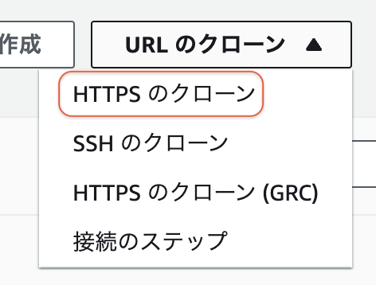

# Git<!-- omit in toc -->

テンプレートファイルをCodeCommitを利用して管理します.

```bash
VSCode起動
> cd [ローカルレポジトリ]
> code .
```

VsCode上で、`Ctrl + Shift + @`を押すと、ターミナルが起動します.

## 1. Git Ignore

`.gitignore`ファイルに管理したくないパスを記載して、レポジトリから除外します.

今回、除外したいもの

- `sam build`で毎度生成されるので`.aws-sam/`フォルダは、管理対象外とします.
- `sam deploy`で生成される`samconfig.toml`ファイルは、管理対象外とします.

```bash
> touch .gitignore
> echo "*/.aws-sam/" >> .gitignore
> echo "*/samconfig.toml" >> .gitignore
```

`.gitignore`ファイルの中身

```text
*/.aws-sam/
*/samconfig.toml
```

VsCodeでは、除外ファイル・フォルダはグレー表示されます.

## 2. Stage

変更をCommitするファイルをステージングエリアに追加します.

 ```bash
 > git add . # 「.」はすべてのファイルを意味します.
 warning: LF will be replaced by CRLF in .gitignore. # 改行コードを置換したメッセージなので無視できます.
 ```

 ```bash
> git status
Changes to be committed: # ステージングエリアにあるファイルが表示されます
  (use "git rm --cached <file>..." to unstage)
        new file:   .gitignore
        new file:   Pipfile
        new file:   Pipfile.lock
        new file:   cfn/template.yml
 ```

VsCodeの場合、ソース管理`Ctrl + Shift + G`でステージングエリアにあるファイルを確認できます.ステージングエリアにあるファイルを右クリックし、「変更のステージング解除」でもとに戻すことができます.

(`Ctrl + Shift + E`でエクスプローラが表示されます.)

## 3. Git Commit

変更・追加したファイルをCodeCommitに登録します.

```bash
> git commit -m 'init commit'
 4 files changed, 601 insertions(+)
 create mode 100644 .gitignore
 create mode 100644 Pipfile
 create mode 100644 Pipfile.lock
 create mode 100644 cfn/template.yml
```

## 4. Git Push

Commitした内容をCodeCommitにPush(Upload)します.

```bash
> git branch
* main       # <- 今いるブランチ名

> git push -u origin [ブランチ名]
Total 4 (delta 0), reused 0 (delta 0), pack-reused 0
To https://git-codecommit.[リージョン].amazonaws.com/v1/repos/[レポジトリ]
 * [new branch]      main -> main
Branch 'main' set up to track remote branch 'main' from 'origin'.
```

マネジメントコンソールから、レポジトリにファイルがアップされているか確認してください.

## 5. Git Clone

CodeCommitのリモートレポジトリをPCのローカルレポジトリにクローンします.

ローカルレポジトリを削除します.(VsCodeでレポジトリを開いている場合は、閉じてください.)

```bash
> cd [ローカルレポジトリ]
> python -m pipenv --rm # Python仮想環境削除
> cd ..
> rm -rf [レポジトリ名]
```

クローンするレポジトリのURLを取得します.

- CLI

  ```bash
  > aws codecommit get-repository --repository-name [レポジトリ名]
  {
    "repositoryMetadata": {
      "accountId": "123456789012",
      "cloneUrlHttp": "https://git-codecommit.[リージョン].amazonaws.com/v1/repos/[レポジトリ]", # クローンURL
    }
  }
  # 1部のみ表示
  ```

- Gui

  CodeCommit > レポジトリ > [レポジトリ名]

  

  でUrlがコピーされます.


Git Clone します.

```bash
> cd [ワークディレクトリ]
> git clone [クローンURL]
remote: Counting objects: 5, done.
Unpacking objects: 100% (5/5), 822 bytes | 137.00 KiB/s, done.
> cd [レポジトリ名] # <- 慣れないと忘れがちです
```

Python 仮想環境削除したので再構築します.

```bash
> python -m pipenv sync
# Pipfile.lockがあるので、ワンライナーで仮想環境からaws sam cli インストールまでやってくれます.
```

## 6. Git Branch

他のはセクションで・・・

## 7. Pull(Merge) Request

他のセクションで・・・