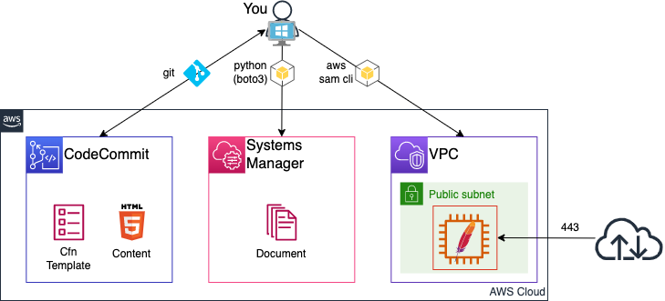
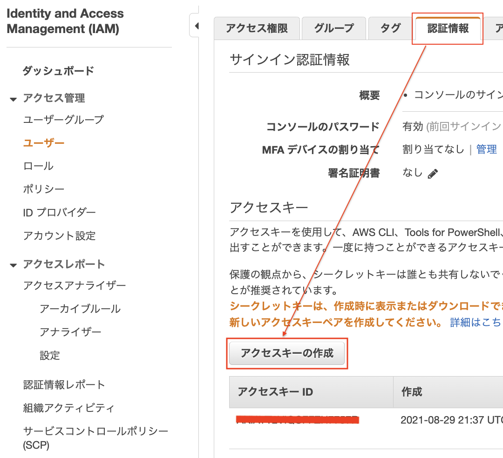
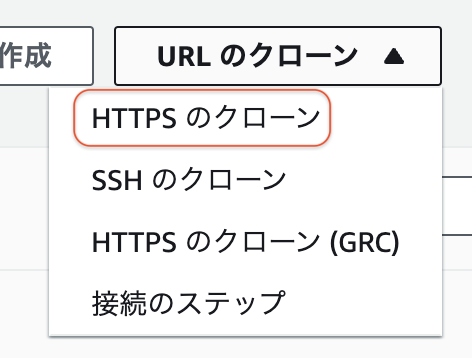
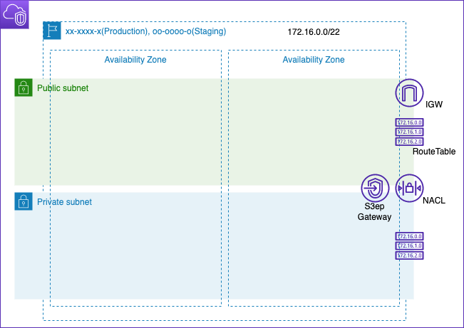
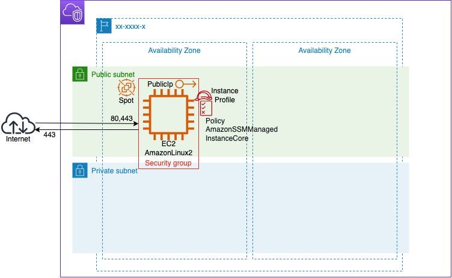

# IaC Self Learning<!-- omit in toc -->

## Contents<!-- omit in toc -->
- [1. はじめに](#1-はじめに)
  - [1.1. 目的](#11-目的)
  - [1.2. Iacメリット・デメリット](#12-iacメリットデメリット)
  - [1.3. IaCを学ぶモチベーション](#13-iacを学ぶモチベーション)
  - [1.4. 表記について](#14-表記について)
  - [1.5. 免責事項](#15-免責事項)
- [2. 開発環境構築](#2-開発環境構築)
  - [2.1. Require](#21-require)
  - [2.2. 設定](#22-設定)
    - [2.2.1. `pip`コマンドを実行して、`aws cli`をインストール](#221-pipコマンドを実行してaws-cliをインストール)
    - [2.2.2. IAMユーザのアクセスキー・シークレットアクセスキーを発行](#222-iamユーザのアクセスキーシークレットアクセスキーを発行)
    - [2.2.3. `aws configure`コマンドを実行して、`アクセスキー`,`シークレットアクセスキー`を設定](#223-aws-configureコマンドを実行してアクセスキーシークレットアクセスキーを設定)
    - [2.2.4. CodeCommit(コード管理)レポジトリ作成](#224-codecommitコード管理レポジトリ作成)
    - [2.2.5. CodeCommit認証設定](#225-codecommit認証設定)
    - [2.2.6. 作業ディレクトリを作成後、レポジトリ クローン](#226-作業ディレクトリを作成後レポジトリ-クローン)
    - [2.2.7. Python仮想環境作成](#227-python仮想環境作成)
    - [2.2.8. VisualStudioCode(以下、VsCode)起動](#228-visualstudiocode以下vscode起動)
- [3. SAM使い方](#3-sam使い方)
  - [3.1. SAM用テンプレートファイル作成](#31-sam用テンプレートファイル作成)
  - [3.2. スタック作成](#32-スタック作成)
  - [3.3. スタック削除](#33-スタック削除)
- [4. Git使い方](#4-git使い方)
  - [4.1. Git Ignore](#41-git-ignore)
  - [4.2. Stage](#42-stage)
  - [4.3. Git Commit](#43-git-commit)
  - [4.4. Git Push](#44-git-push)
  - [4.5. Git Clone](#45-git-clone)
  - [4.6. その他](#46-その他)
- [5. CloudFormationテンプレート構造](#5-cloudformationテンプレート構造)
  - [5.1. クラウドフォーメーションとは](#51-クラウドフォーメーションとは)
  - [5.2. テンプレートファイル](#52-テンプレートファイル)
    - [5.2.1. フォーマット](#521-フォーマット)
    - [5.2.2. 構造](#522-構造)
    - [5.2.3. パラメータセクション](#523-パラメータセクション)
    - [5.2.4. リソースセクション](#524-リソースセクション)
  - [5.3. 疑似パラメータ](#53-疑似パラメータ)
  - [5.4. 組み込み関数](#54-組み込み関数)
- [6. IaCでEC2を立てる](#6-iacでec2を立てる)
  - [6.1. スタック参照の種類](#61-スタック参照の種類)
  - [6.2. VPCテンプレート作成(vpc/vpc.yml)](#62-vpcテンプレート作成vpcvpcyml)
  - [6.3. EC2テンプレート作成(instance/web.yml)](#63-ec2テンプレート作成instancewebyml)
- [7. IaCでApacheのセットアップ](#7-iacでapacheのセットアップ)
  - [7.1. 手動でWebサーバ構築](#71-手動でwebサーバ構築)
    - [7.1.1. Apacheインストール](#711-apacheインストール)
    - [7.1.2. Webサイト確認](#712-webサイト確認)
  - [7.2.](#72)

## 1. はじめに

### 1.1. 目的

- AWSサービスを使い、単純構成のWebサーバーを構築、デプロイを自動化し基本的なことを学び、IaCの開発・デバッグ・テストができるようになること目的としています.構成やセキュリティ設定等は触れません.

    

    |Item|役割|
    |---|---|
    |git|CodeCommitとコードをやり取りするためのアプリ|
    |CodeCommit|コード管理.GithubやGitlabのAWS版|
    |CfnTemplate|Webサーバを構築するためのCloudFormationTemplateファイル|
    |Content|Web公開するコンテンツ(html)|
    |Python(boto3)|boto3: Pythonのモジュールでaws cliのPython版|
    |Document|EC2で動かすBATファイルのようなもの|
    |aws sam cli|PythonのモジュールでCloudFormationの拡張版.GUIより早くTry&Errorが可能|

### 1.2. Iacメリット・デメリット

- メリット
  - 手順書簡素化
  - 時間の有効活用(手順書見ながら作業不要なので、他のことに時間が使える)
  - 冪等性(誰がやっても同じ結果に) → 品質のむらがない
- デメリット
  - 学習コスト(時間がかかる)
  - 開発コスト(時間)が高い、覚えなければならないことが沢山
→ デメリットの方が大きいのでやる意味があるのが？正直、微妙.

### 1.3. IaCを学ぶモチベーション

- Docker(K8S) → ボタンぽちぽちじゃなく、CLIです.
- CD/CI       → ボタンぽちぽちじゃなく、CLIです.
- サーバーレス  → そもそもInfra不要!?.

とモダンな開発にコードを書くことは必須です.

- 環境定義署をおこして、
- 手順書見ながら、
- 作業証跡のスクショを切り貼り
- スクショと定義書を差異チェック

の手間を軽減できる筈.

### 1.4. 表記について

```text
ps> Powershellを示す
> Gitbashやbashを示す
```

### 1.5. 免責事項

本文書の情報については充分な注意を払っておりますが、その内容の正確性等に対して一切保障するものではありません.本文章の利用で発生したいかなる結果について、一切責任を負わないものとします.また、本文書のご利用により、万一、ご利用者様に何かしらの不都合や損害が発生したとしても、責任を負うものではありません.

## 2. 開発環境構築

### 2.1. Require

- [Python3.9](https://www.python.org/downloads/)
  - [パッケージのインストール必読](https://www.python.jp/install/windows/install.html)
- [git](https://git-scm.com/)
  - Git Credential Managerはインストールしないこと.
- [VisualStuioCode](https://code.visualstudio.com/download)

### 2.2. 設定

#### 2.2.1. `pip`コマンドを実行して、`aws cli`をインストール

```bash
ps> python -m pip install pip --upgrade --user
ps> python -m pip install awscli --user
ps> python -m pip install pipenv --user
```

#### 2.2.2. IAMユーザのアクセスキー・シークレットアクセスキーを発行



#### 2.2.3. `aws configure`コマンドを実行して、`アクセスキー`,`シークレットアクセスキー`を設定

```bash
aws configure
AWS Access Key ID : [アクセスキー]
AWS Secret Access Key : [シークレットキー]
Default region name : [リージョン]
Default output format : json
```

#### 2.2.4. CodeCommit(コード管理)レポジトリ作成

```bash
ps> aws codecommit create-repository --repository-name [レポジトリ名]
```

出力例

```bash
{
    "repositoryMetadata": {
        "accountId": "[アカウントID]",
        "repositoryName": "[レポジトリ名]",
        "cloneUrlHttp": "https://git-codecommit.[リージョン].amazonaws.com/v1/repos/[レポジトリ名]",
        "cloneUrlSsh": "ssh://git-codecommit.[リージョン].amazonaws.com/v1/repos[レポジトリ名]",
        "Arn": "arn:aws:codecommit:[リージョン]:[アカウントID]:[レポジトリ名]"
    }
}
```

#### 2.2.5. CodeCommit認証設定

```bash
ps> git config --global user.name [YOUR NAME]
ps> git config --global user.email [YOUR EMAIL ADDRESS]
ps> git config --global "credential.https://git-codecommit.*.amazonaws.com/v1/repos/[リポジトリ名].helper" '!aws codecommit credential-helper $@'
ps> git config --global "credential.https://git-codecommit.*.amazonaws.com/v1/repos/[リポジトリ名].UseHttpPath" true
```

#### 2.2.6. 作業ディレクトリを作成後、レポジトリ クローン

```bash
ps> $wkdir = "$env:userprofile/Documents/[フォルダ名]" #[フォルダ名]は作成するフォルダの名前です
ps> if (!(Test-Path $wkdir)) { New-Item -Path $wkdir -ItemType Directory | Out-Null }
ps> Set-Location -Path $wkdir
ps> git clone https://git-codecommit.[リージョン].amazonaws.com/v1/repos/[レポジトリ名]
ps> Set-Location [レポジトリ名]
ps> (Get-Location).Path # ← ここに表示されるPathがローカルレポジトリと言います.
```

#### 2.2.7. Python仮想環境作成

```bash
> cd [ローカルレポジトリ]
> python -m pipenv --python 3.9
Creating a virtualenv for this project...
Pipfile: C:\Users\xxxxxxxx\Documents\work\[レポジトリ名]\Pipfile
Using C:/Users/xxxxxxxx/AppData/Local/Programs/Python/Python39/python.exe (3.9.10) to create virtualenv...
[====] Creating virtual environment...created virtual environment CPython3.9.10.final.0-64 in 21306ms
  creator CPython3Windows(dest=C:\Users\xxxxxxxx\.virtualenvs\[レポジトリ名]-wTKRaSAf, clear=False, no_vcs_ignore=False, global=False)
  seeder FromAppData(download=False, pip=bundle, setuptools=bundle, wheel=bundle, via=copy, app_data_dir=C:\Users\xxxxxxxx\AppData\Local\pypa\virtualenv)
    added seed packages: pip==22.0.4, setuptools==62.1.0, wheel==0.37.1
  activators BashActivator,BatchActivator,FishActivator,NushellActivator,PowerShellActivator,PythonActivator

Successfully created virtual environment!
Virtualenv location: C:\Users\xxxxxxxx\.virtualenvs\m[レポジトリ名]-wTKRaSAf
Creating a Pipfile for this project...
```

```bash
> cd [ローカルレポジトリ]
> python -m pipenv install aws-sam-cli
Installing aws-sam-cli...
Adding aws-sam-cli to Pipfile's [packages]...
Installation Succeeded
Pipfile.lock not found, creating...
Locking [dev-packages] dependencies...
Locking [packages] dependencies...
          Building requirements...
Resolving dependencies...
Success!
Updated Pipfile.lock (dc4449)!
Installing dependencies from Pipfile.lock (dc4449)...
  ================================ 1/1 - 00:00:00
To activate this project's virtualenv, run pipenv shell.
Alternatively, run a command inside the virtualenv with pipenv run.
```

#### 2.2.8. VisualStudioCode(以下、VsCode)起動

```bash
> cd [ローカルレポジトリ]
> code .
```

## 3. SAM使い方

簡単なテンプレートファイルを作成し、SAMでスタックの作成・削除を実施します.

### 3.1. SAM用テンプレートファイル作成

```bash
VSCode起動
> cd [ローカルレポジトリ]
> code .
```

VsCode上で、`Ctrl + Shift + @`を押すと、ターミナルが起動します.

```bash
> python -m pipenv shell # Python仮想環境のShellに切り替え
Launching subshell in virtual environment...

> mkdir cfn
> cd cfn
cfn> touch template.yml
```

- template.yml

    ```yaml
    AWSTemplateFormatVersion: '2010-09-09'  # 宣言文のようなもの
    Transform: AWS::Serverless-2016-10-31   # aws sam cliを利用するために必要
    Description: >                          # 説明文
        First Cloud Formation
    Parameters:                             # スタック作成時の入力パラメータ
      VpcCidr:                              # パラメータ名
        Description: Cidr block for vpc.    # パラメータ説明文
        Type: String                        # パラメータ型
        Default: 10.0.0.0/22                # 初期値
    Resources:                              # AWSリソースブロック
      Vpc:                                  # リソース論理名
        Type: AWS::EC2::VPC                 # リソースの識別
        Properties:                         # リソースプロパティブロック
          CidrBlock: !Ref VpcCidr           # 変数 VpcCidrで指定された値
          Tags:
          - Key: Name
            Value: !Ref AWS::StackName      # 擬似パラメータ: スタック名
    ```

    3行目までは、このような書き方が必要なんだと覚えてください。

    Parameter: Googleで[cfn パラメータ]でリファレンスを検索してください.リスト選択など、入力値のValidation方法などを調べます.

    Resource: Googleで[cfn サービス名(やAWS::EC2::VPC)]でリファレンスを検索してください.プロパティの書き方,必須入力値や戻り値などを調べます.

    擬似パラメータ: Googleで[cfn 擬似パラメータ]でリファレンスを検索してください.AWSアカウントやリージョンにしばられないテンプレートファイル作りなどで使います.

### 3.2. スタック作成

```bash
cfn> sam build       # cfnフォルダにtemplate.ymlファイルがあれば、Buildしてくれる
Build Succeeded
Built Artifacts  : .aws-sam\build
Built Template   : .aws-sam\build\template.yaml
Commands you can use next
=========================
[*] Validate SAM template: sam validate
[*] Invoke Function: sam local invoke
[*] Test Function in the Cloud: sam sync --stack-name {stack-name} --watch
[*] Deploy: sam deploy --guided
```

```bash
cfn> sam deploy -g   # Buildしたテンプレファイルを展開してくれる(初回は、「-g」パラメータ入力が必須)
Configuring SAM deploy
======================
        Looking for config file [samconfig.toml] :  Not found
        Setting default arguments for 'sam deploy'
        =========================================
        Stack Name [sam-app]: [STACK NAME]              # CloudFormation スタック名を入力
        AWS Region [ap-northeast-1]:                    # スタックを作成するリージョン名(レポジトリと同じリージョンを指定)
        Parameter VpcCidr [10.0.0.0/22]:                # テンプレートに作成したパラメータ
        Confirm changes before deploy [y/N]:            # デプロイ前に変更点の確認するか
        Allow SAM CLI IAM role creation [Y/n]:          # SAM CLI から IAMロールを作成することを許可するか
        Capabilities [['CAPABILITY_IAM']]:              # IAM名指定やネストスタックを利用する場合、CAPABILITY_NAMED_IAM、CAPABILITY_AUTO_EXPANDを指定する
        Disable rollback [y/N]:                         # スタック作成に失敗した場合、Rollbackの有効・無効の選択
        Save arguments to configuration file [Y/n]:     # 入力した値をConfigファイルに保存するか
        SAM configuration file [samconfig.toml]:        # Configファイル名指定
        SAM configuration environment [default]:        # Configu環境名指定

CloudFormation stack changeset                          # ChangesetでVPCが追加させることがわかる
---------------------------------------------------------------------------------------------------------
Operation                  LogicalResourceId          ResourceType               Replacement
---------------------------------------------------------------------------------------------------------   
+ Add                      Vpc                        AWS::EC2::VPC              N/A
---------------------------------------------------------------------------------------------------------

CloudFormation events from stack operations             # スタック作成のログ
---------------------------------------------------------------------------------------------------------
ResourceStatus             ResourceType               LogicalResourceId          ResourceStatusReason       
---------------------------------------------------------------------------------------------------------   
CREATE_IN_PROGRESS         AWS::EC2::VPC              Vpc                        -
CREATE_IN_PROGRESS         AWS::EC2::VPC              Vpc                        Resource creation        
                                                                                 Initiated
CREATE_COMPLETE            AWS::EC2::VPC              Vpc                        -
CREATE_COMPLETE            AWS::CloudFormation::Sta   miya-stack                 -
                           ck
---------------------------------------------------------------------------------------------------------   

Successfully created/updated stack - miya-stack in ap-northeast-3
```

マネージメントコンソールからスタックが作成されていることを確認してみましょう.

### 3.3. スタック削除

```bash
cfn> sam delete
Are you sure you want to delete the stack my-stack in the region ap-northeast-1 ? [y/N]: y
Are you sure you want to delete the folder my-stack in S3 which contains the artifacts? [y/N]: y
- Deleting S3 object with key my-stack/aec7e9cf2ac98b0463f03cbc8b8c8713.template
- Deleting Cloudformation stack my-stack

Deleted successfully
```

マネージメントコンソールからスタックが削除されていることを確認してみましょう.

## 4. Git使い方

テンプレートファイルをCodeCommitを利用して管理します.

```bash
VSCode起動
> cd [ローカルレポジトリ]
> code .
```

VsCode上で、`Ctrl + Shift + @`を押すと、ターミナルが起動します.

### 4.1. Git Ignore

`.gitignore`ファイルに管理したくないパスを記載して、レポジトリから除外します.

今回、除外したいもの

- `sam build`で毎度生成されるので`.aws-sam/`フォルダは、管理対象外とします.
- `sam deploy`で生成される`samconfig.toml`ファイルは、管理対象外とします.

```bash
> touch .gitignore
> echo "*/.aws-sam/" >> .gitignore
> echo "*/samconfig.toml" >> .gitignore
```

`.gitignore`ファイルの中身

```text
*/.aws-sam/
*/samconfig.toml
```

VsCodeでは、除外ファイル・フォルダはグレー表示されます.

### 4.2. Stage

変更をCommitするファイルをステージングエリアに追加します.

 ```bash
 > git add . # 「.」はすべてのファイルを意味します.
 warning: LF will be replaced by CRLF in .gitignore. # 改行コードを置換したメッセージなので無視できます.
 ```

 ```bash
> git status
Changes to be committed: # ステージングエリアにあるファイルが表示されます
  (use "git rm --cached <file>..." to unstage)
        new file:   .gitignore
        new file:   Pipfile
        new file:   Pipfile.lock
        new file:   cfn/template.yml
 ```

VsCodeの場合、ソース管理`Ctrl + Shift + G`でステージングエリアにあるファイルを確認できます.ステージングエリアにあるファイルを右クリックし、「変更のステージング解除」でもとに戻すことができます.

(`Ctrl + Shift + E`でエクスプローラが表示されます.)

### 4.3. Git Commit

変更・追加したファイルをCodeCommitに登録します.

```bash
> git commit -m 'init commit'
 4 files changed, 601 insertions(+)
 create mode 100644 .gitignore
 create mode 100644 Pipfile
 create mode 100644 Pipfile.lock
 create mode 100644 cfn/template.yml
```

### 4.4. Git Push

Commitした内容をCodeCommitにPush(Upload)します.

```bash
> git branch
* main       # <- 今いるブランチ名

> git push -u origin [ブランチ名]
Total 4 (delta 0), reused 0 (delta 0), pack-reused 0
To https://git-codecommit.[リージョン].amazonaws.com/v1/repos/[レポジトリ]
 * [new branch]      main -> main
Branch 'main' set up to track remote branch 'main' from 'origin'.
```

マネジメントコンソールから、レポジトリにファイルがアップされているか確認してください.

### 4.5. Git Clone

CodeCommitのリモートレポジトリをPCのローカルレポジトリにクローンします.

ローカルレポジトリを削除します.(VsCodeでレポジトリを開いている場合は、閉じてください.)

```bash
> cd [ローカルレポジトリ]
> python -m pipenv --rm # Python仮想環境削除
Removing virtualenv...
> cd ..
> rm -rf [レポジトリ名]
```

クローンするレポジトリのURLを取得します.

- CLI

  ```bash
  > aws codecommit get-repository --repository-name [レポジトリ名]
  {
    "repositoryMetadata": {
      "accountId": "123456789012",
      "cloneUrlHttp": "https://git-codecommit.[リージョン].amazonaws.com/v1/repos/[レポジトリ]", # クローンURL
    }
  }
  # 1部のみ表示
  ```

- GUI

  CodeCommit > レポジトリ > [レポジトリ名]

  

  でUrlがコピーされます.

Git Clone します.

```bash
> cd [ワークディレクトリ]
> git clone [クローンURL]
remote: Counting objects: 5, done.
Unpacking objects: 100% (5/5), 822 bytes | 137.00 KiB/s, done.
> cd [レポジトリ名] # <- 慣れないと忘れがちです
```

Python 仮想環境削除したので再構築します.

```bash
> python -m pipenv sync
Creating a virtualenv for this project...
All dependencies are now up-to-date!
```

### 4.6. その他

branch, pull requestは、後ほど.

## 5. CloudFormationテンプレート構造

### 5.1. クラウドフォーメーションとは

Templateファイル(抽象的)からスタック(実体・リソース)を作成します.

同じテンプレートファイルで異なる名前のスタックを作成すると、柴田大知・未崎のような双子関係になります.なので、本番・ステージング環境の構築やBlue＆GreenDeployに活用できます.

### 5.2. テンプレートファイル

#### 5.2.1. フォーマット

Templateファイルは、JSON・YAML形式をサポートしていますが、可読性が良いYAMLを採用します.

Cfnは、[YAML](https://yaml.org/)バージョン1.1の仕様をサポートしていますが、以下の機能は非サポートです.

- binary, omap, pairs, set, timestamp
- Aliases
- Hash merges
  
#### 5.2.2. 構造

テンプレートのセクション

```yaml
AWSTemplateFormatVersion: "version date"
Description:
  String
Metadata:
  template metadata
Parameters:
  set of parameters
Rules:
  set of rules
Mappings:
  set of mappings
Conditions:
  set of conditions
Transform:
  set of transforms
Resources:
  set of resources
Outputs:
  set of outputs
```

- AWSTemplateFormatVersion
  - テンプレートが準拠している AWS CloudFormation テンプレートバージョン.
- Description(オプション)
  - テンプレートの説明文.AWSTemplateFormatVersionセクションの後に記述すること.
- Metadata(オプション)
  - テンプレートに関する追加情報を提供するオブジェクト.
- Parameters(オプション)
  - スタックを作成または更新する際、テンプレートに渡すことができる値.
- Rules(オプション)
  - スタックの作成またはスタックの更新時に、テンプレートに渡されたパラメータまたはパラメータの組み合わせを検証.
- Mappings(オプション)
  - キーと関連する値のマッピング.Resources セクションと Outputs セクションで Fn::FindInMap 組み込み関数を使用することで、キーと対応する値を一致させることが可能.
- Conditions(オプション)
  - 特定のリソースを作成するか、リソースのプロパティ値の制御など、判断条件を定義.
- Transform(オプション)
  - SAMの場合、Transform: AWS::Serverless-2016-10-31.
- Resources(必須)
  - スタックリソースとそのプロパティを指定.
- Outputs(オプション)
  - スタックの戻り値やパラメータ値を出力.

#### 5.2.3. パラメータセクション

Parametersセクションの書き方

```yaml
Parameters:
  LogicalID:
    Type: DataType
    Property: Value
```

- LogicalID:
  - テンプレート内で一意なID

- Type:
  - String: 文字列
  - Number: 整数または浮動小数点
  - [他](https://docs.aws.amazon.com/ja_jp/AWSCloudFormation/latest/UserGuide/parameters-section-structure.html#parameters-section-structure-properties-type)

- Property:
  - AllowedPattern: String 型に使用できるパターンを表す正規表現
  - AllowedValues: ラメーターに許容される一連の値を含む配列
  - ConstraintDescription: 制約が違反された場合に、制約について説明する文字列
  - Default: スタックの作成時に値を指定しなかった場合に、テンプレートで使用される値
  - Description: パラメーターについて説明
  - MaxLength: String 型に使用できる最大文字数
  - MinLength: String 型に使用できる最小文字数
  - MaxValue: Number 型に使用できる数値の最大値
  - MinValue: Number 型に使用できる数値の最小値
  - NoEcho: NoEcho 属性を true に設定するとアスタリスク (*****) としてマスクされたパラメータ値を返します

#### 5.2.4. リソースセクション

Resourcesセクションの書き方

```yaml
Resources:
  LogicalID:
    Type: ResourceType
    Properties:
      Key: Value
```

- LogicalID:
  - テンプレート内で一意なID

- Type:
  - [ここから探す](https://docs.aws.amazon.com/ja_jp/AWSCloudFormation/latest/UserGuide/aws-template-resource-type-ref.html)

- Properties:
  - Typeで指定したResourceTypeに従って記述します.

### 5.3. 疑似パラメータ

疑似パラメータとは、事前定義されたパラメータ.

例

```yaml
Resources:
  Vpc:
    Type: AWS::EC2::VPC
    Properties:
      CidrBlock: 10.0.0.0/22
      Tags:
      - Key: Name
        Value: !Ref AWS::Region # ← スタックを作成したリージョン名が入る
```

疑似パラメータ

- AWS::AccountId
  - スタックが作成されているアカウントの AWS アカウント ID
- AWS::NotificationARNs
  - スタックの通知 Amazon リソースネーム (ARN) のリスト.リストから 1 つの ARN を取得するには、Fn::Select を使用
- AWS::NoValue
  - Fn::If 組み込み関数の戻り値として指定すると、対応するリソースプロパティを削除
- AWS::Partition
  - 標準の AWS リージョンの場合、パーティションは aws
  - 中国 (北京および寧夏) リージョンのパーティションは aws-cn
  - AWS GovCloud (US-West) リージョンにあるリソースのパーティションは aws-us-gov
- AWS::Region
  - リソースが作成されているリージョンを表す文字列
- AWS::StackId
  - スタックの ID
- AWS::StackName
  - スタックの名前
- AWS::URLSuffix
  - 通常 `amazonaws.com`
  - 中国 (北京) リージョンのサフィックスは `amazonaws.com.cn`

### 5.4. 組み込み関数

スタックの管理に役立ついくつかの組み込み関数

例

```yaml
Resources:
  Vpc:
    Type: AWS::EC2::VPC
    Properties:
      CidrBlock: 10.0.0.0/22
      Tags:
      - Key: Name
        Value: !Ref AWS::Region # パラメータを参照する関数
      - Key: Name1
        Value: !Sub ${AWS::AccounId}-vpc # 変数と文字結合
```

[関数たち](https://docs.aws.amazon.com/ja_jp/AWSCloudFormation/latest/UserGuide/intrinsic-function-reference.html)

## 6. IaCでEC2を立てる

```bash
VSCode起動
> cd [ローカルレポジトリ]
> code .
```

### 6.1. スタック参照の種類

1. 1ファイル完結
2. 複数ファイル(NestStack(AWS::CloudFormation::Stack))
3. 複数ファイル(CrossReference(Export, !ImportValue))
4. 複数ファイル(ParameterStore(AWS::SSM::Parameter::Value))

特段理由はありませんが、NestStackでテンプレートを作成します.

### 6.2. VPCテンプレート作成(vpc/vpc.yml)

1. Build範囲

    

1. ルートテンプレート作成(template.yml)

    親テンプレート.

    [cfn/template.yml](./6.template/1/template.yml)

1. VPCテンプレートファイル作成

    ```bash
    cfn> mkdir vpc
    cfn> touch vpc/vpc.yml
    ```

    [vpc/vpc.yml](./6.template/1/vpc.yml)

1. Deploy

    ```bash
    cfn> sam build && sam deploy -g --capabilities CAPABILITY_IAM CAPABILITY_AUTO_EXPAND
    Setting default arguments for 'sam deploy'
    =========================================
    Stack Name [sam-app]: スタック名
    AWS Region [ap-northeast-1]: リージョン
    Parameter Env [stg]:
    Parameter VpcCidr [10.0.0.0/22]:
    Confirm changes before deploy [y/N]:
    Allow SAM CLI IAM role creation [Y/n]:
    Disable rollback [y/N]:
    Save arguments to configuration file [Y/n]:
    SAM configuration file [samconfig.toml]:
    SAM configuration environment [default]:

    Successfully created/updated stack -  スタック名 in リージョン名
    ```

### 6.3. EC2テンプレート作成(instance/web.yml)

1. Build範囲

    

1. ルートテンプレート作成(template.yml)

    親テンプレート.

    [cfn/template.yml](./6.template/2/template.yml)

1. Iamテンプレートファイル作成

    ```bash
    cfn> mkdir iam
    cfn> touch iam/iam.yml
    ```

1. EC2テンプレートファイル作成

    ```bash
    cfn> mkdir instance
    cfn> touch instance/web.yml
    ```

    [instance/web.yml](6.template/2/web.yml)

1. Deploy

    ```bash
    cfn> sam build && sam deploy -g --capabilities CAPABILITY_IAM CAPABILITY_AUTO_EXPAND
    Setting default arguments for 'sam deploy'
    =========================================
    Stack Name [sam-app]: スタック名
    AWS Region [ap-northeast-1]: リージョン
    Parameter Env [stg]:
    Parameter VpcCidr [10.0.0.0/22]:
    Parameter BuildWeb [yes]:                     # ← ここの値を変えることでEC2のBuild・Terminateをコントロールします.
    Confirm changes before deploy [y/N]:
    Allow SAM CLI IAM role creation [Y/n]:
    Disable rollback [y/N]:
    Save arguments to configuration file [Y/n]:
    SAM configuration file [samconfig.toml]:
    SAM configuration environment [default]:

    Successfully created/updated stack -  スタック名 in リージョン名
    ```

1. Session Manager 接続

    Session Manager から OS にログインできることを確認してください.

    Session Managerのデフォルトは、`sh`です.`# bash`で使い慣れたTerminalに切り替えができます.

    - Session Manager
  
        Managed Console > EC2 > Instance > Connect > Session Manager

## 7. IaCでApacheのセットアップ

CloudFormationで作成できるのは、OSまでです.OSレイア以上のセットアップはShellScriptで行います.

一般的に、Ansibleなどのツールで行うのが一般的ですが、Ansible知らないので力技でセットアップします.

ポイント
- Shellが何回実行されても同じ結果になるようにすること(冪等性).

### 7.1. 手動でWebサーバ構築

手動でやっていることを、Script化します.

#### 7.1.1. Apacheインストール

[ShellScript](6.template/3/setup.sh)をSessionManagerからWebサーバにログイン、`sudo su -`に切り替えて実行します.

Tag名の値は、環境に合わせて変更してください.

setup.shをコピーし、ターミナルに貼り付けます.

#### 7.1.2. Webサイト確認

1. WebサーバのGlobalIPを確認.(Cfn > スタック > ルートスタック名 > 出力 もしくは、 EC2 インスタンスより)
2. GoogleChromeにGlobalIPアドレスを入力し、"Test Page"が表示されることを確認してください.
3. IaCなので、
    ```bash
    > curl -v http://xxx.xxx.xxx.xxx
    ```

### 7.2. 

    <!-- `samconfig.toml`の`capabilities`の設定値を変更します.

    ```bash
    sed -i 's/capabilities =.*/capabilities = "CAPABILITY_IAM CAPABILITY_AUTO_EXPAND"/g' samconfig.toml
    # samconfig.tomlの「capabilities =」文字が含まれる行を「capabilities = "CAPABILITY_IAM CAPABILITY_AUTO_EXPAND"」に置換します.
    ```

    ```toml
    capabilities = "CAPABILITY_IAM"
      ↓
    capabilities = "CAPABILITY_IAM CAPABILITY_AUTO_EXPAND" -->
