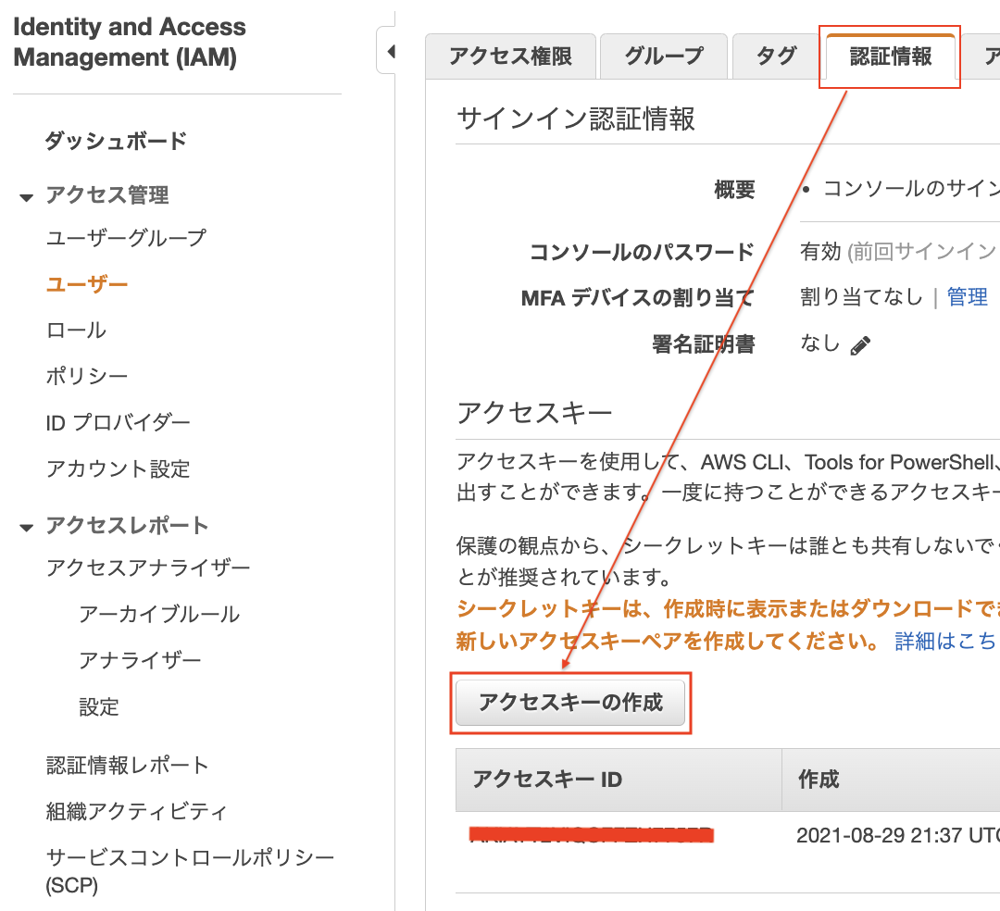
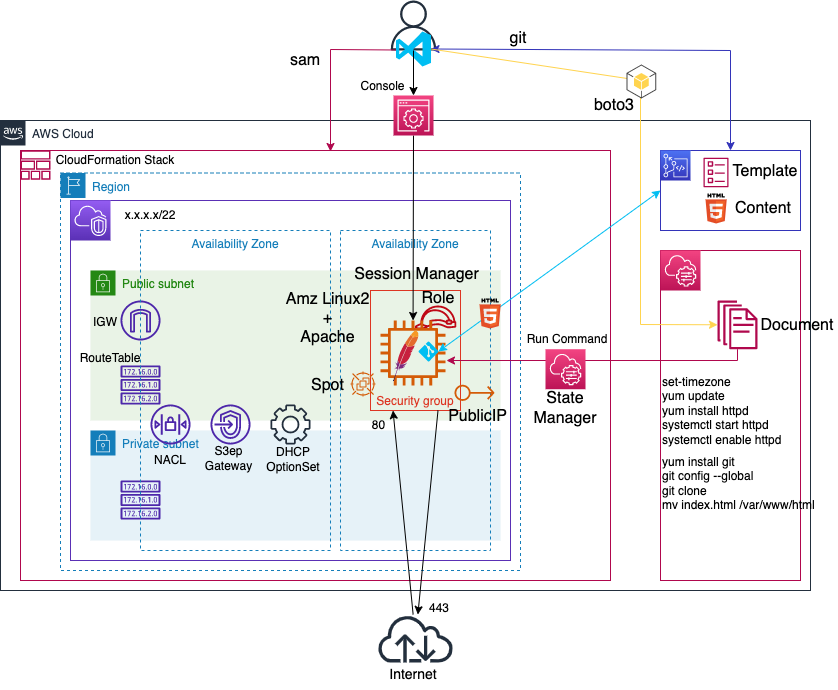
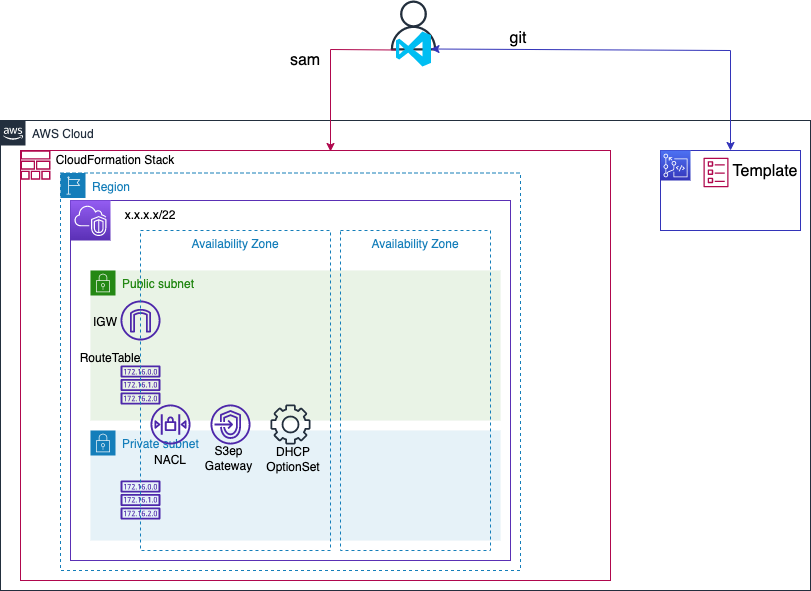
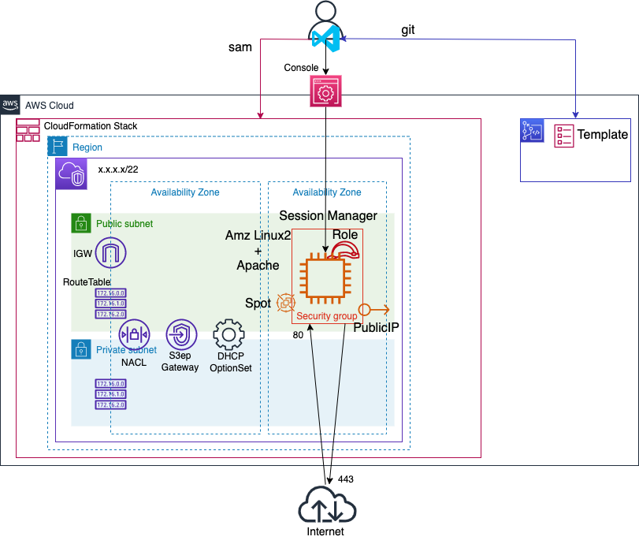
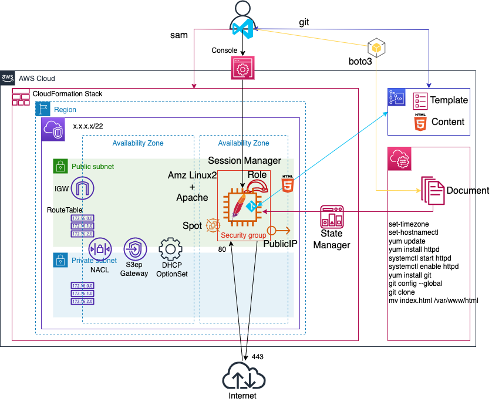

# IaC Self Learning<!-- omit in toc -->

## Contents<!-- omit in toc -->

- [1. はじめに](#1-はじめに)
  - [1.1. 目的](#11-目的)
  - [1.2. Iacメリット・デメリット](#12-iacメリットデメリット)
  - [1.3. IaCをやるモチベーション](#13-iacをやるモチベーション)
  - [1.4. 表記について](#14-表記について)
- [2. 免責事項](#2-免責事項)
- [3. 開発環境構築](#3-開発環境構築)
  - [3.1. インストール](#31-インストール)
  - [3.2. 設定](#32-設定)
- [4. ツールの使い方](#4-ツールの使い方)
  - [4.1. GitBash](#41-gitbash)
  - [4.2. VSCode](#42-vscode)
  - [4.3. CodeCommit](#43-codecommit)
  - [4.4. AWS SAM](#44-aws-sam)
    - [4.4.1. 準備](#441-準備)
    - [4.4.2. スタック操作](#442-スタック操作)
- [5. クラウドフォーメーションテンプレートの構文](#5-クラウドフォーメーションテンプレートの構文)
  - [5.1. フォーマット](#51-フォーマット)
    - [5.1.1. 構造](#511-構造)
    - [5.1.2. パラメータセクション](#512-パラメータセクション)
    - [5.1.3. リソースセクション](#513-リソースセクション)
  - [5.2. 疑似パラメータ](#52-疑似パラメータ)
  - [5.3. 組み込み関数](#53-組み込み関数)
- [6. SystemsManagerドキュメント](#6-systemsmanagerドキュメント)
  - [6.1. 構文](#61-構文)
    - [6.1.1. 要素](#611-要素)
  - [6.2. コマンドドキュメント](#62-コマンドドキュメント)
- [7. IaCの開発](#7-iacの開発)
  - [7.1. Webサイトのレポジトリ作成](#71-webサイトのレポジトリ作成)
  - [7.2. VPCテンプレート](#72-vpcテンプレート)
  - [7.3. EC2テンプレート](#73-ec2テンプレート)
  - [7.4. Webサーバーセットアップスクリプト開発](#74-webサーバーセットアップスクリプト開発)
  - [7.5. Cfnでデプロイ](#75-cfnでデプロイ)
  - [スタック削除とまとめ](#スタック削除とまとめ)

## 1. はじめに

### 1.1. 目的

- IaCの開発・デバッグ・テストができるようになること目的としています.セキュリティ,CD/CI等には触れません.
- IaCは、Code化することが目的ではなくCode化することの先にある「楽したい」です.
- ツールの基本的な操作を学びます
  - Codeのバージョン管理ツールであるCodeCommitの基本的な使い方を学びます.
  - OSの操作するShellScriptの基本的な開発を学びます.
  - AWSリソースを作成するCloudFormationの基本的な開発を学びます.

ツールの利用用途を図にしてみました.


|Item|役割|
|---|---|
|CodeCommit|バージョン管理.GithubやGitlabのAWS版.|
|&nbsp;git|開発したコードのバージョン管理やCodeCommitと連携するためのアプリ|
|&nbsp;CfnTemplate|Webサーバを構築するためのCloudFormationTemplateファイル|
|&nbsp;Content|Web公開するコンテンツ(html)|
|SystemsManager|いろいろなサービス群の総称.すみません、わかりやすくお伝えすることができません|
|&nbsp;Python(boto3)|boto3: Pythonのモジュールでaws cliのPython版.Boto3でShellScriptをAWSにアップします|
|&nbsp;Document|SystemsManagerサービス群の一つ.RemoteShellScriptのようなもの|
|aws sam cli|CLIでテンプレートファイルからスタックを作成します|

### 1.2. Iacメリット・デメリット

- メリット
  - 手順書簡素化
  - 時間の有効活用(手順書見ながら作業不要なので、他のことに時間が使える)
  - 冪等性(誰がやっても同じ結果に) → 品質のむらがない
- デメリット
  - 学習コスト
  - 開発コスト
  - Officeドキュメントとコードの2重管理(レビューのためのドキュメント作り)

→ デメリットの方が大きい.

### 1.3. IaCをやるモチベーション

- Docker      → 残念ながらボタンポチポチではないです.
- CD/CI       → 残念ながらボタンポチポチではないです.
- サーバーレス  → インフラ不要

とモダンな開発にコードを書くことは必須.

- 環境定義署をおこして、
- 手順書見ながら、
- 作業証跡のスクショを切り貼り
- スクショと定義書の差異チェック

の手間を軽減できる筈.

### 1.4. 表記について

```text
> Gitbashやbashを示す

プロンプトの文字は親フォルダを示す.
> : work directory
repo>: work/repository
cfn> : work/repository/cfn
```

## 2. 免責事項

本文書の情報については充分な注意を払っておりますが、その内容の正確性等に対して一切保障するものではありません.本文章の利用で発生したいかなる結果について、一切責任を負わないものとします.また、本文書のご利用により、万一、ご利用者様に何かしらの不都合や損害が発生したとしても、責任を負うものではありません.

## 3. 開発環境構築

開発環境

Windows10

### 3.1. インストール

下記、3つのソフトをインストールしてください.

- [Python3.9](https://www.python.org/downloads/)
  - [パッケージのインストール必読](https://www.python.jp/install/windows/install.html)
- [git](https://git-scm.com/)
  - Git Credential Managerはインストールしないこと.
  - Gitbashもインストールされます.
- [VisualStudioCode](https://code.visualstudio.com/download)
  - 統合開発環境.お好みでどうぞ.

### 3.2. 設定

1. `pip`コマンドを実行して、`aws cli`をインストール

    Pythonのパッケージを管理するものが`pip`です.

    `pip`でpipをUpgrade、awscli、pipenvをインストールします.

    ```bash
    ps> python -m pip install pip --upgrade --user
    ps> python -m pip install awscli --user
    ps> python -m pip install pipenv --user
    ```

1. IAMユーザのアクセスキー・シークレットアクセスキーを発行

    

1. `aws configure`コマンドを実行して、`アクセスキー`,`シークレットアクセスキー`を設定

    ```bash
    ps> aws configure
    AWS Access Key ID : [アクセスキー]
    AWS Secret Access Key : [シークレットキー]
    Default region name : [リージョン]
    Default output format : json
    ```

## 4. ツールの使い方

### 4.1. GitBash

Windows標準のPowerShellやCommand Promptだと少し使いずらいので代わりにGitBashを利用します.

- GitBash起動

    スタート > gitbash(入力) > Git Bash を起動

- フォルダセパレート文字

    `\`円マークではなく`/`スラッシュ

### 4.2. VSCode

無料で使える統合開発環境.メモ帳・サクラエディタでも開発は可能ですが、シンタックスエラーなど視覚的に教えてくれるので便利です.

- VSCode起動

  ```bash
  # VSCode起動し、フォルダを開く.
  > cd workdirectory
  > code .
  ```

  VSCode起動: Windows > スタート > code(入力) > Visual Studio Code を起動.

  フォルダを開く: VSCode > ファイル > フォルダを開く > Work Directory を選択.

- VSCode ショートカット

  - Terminal

    [VSCode Terminal ShortCut](https://www.maridegi.jp/entry/2020/11/28/145846)

    - Terminal起動: `Ctrl + Shift + @` (Ctrl+`)
    - Terminal表示: `Ctrl + @`
    - Terminal分割: `Ctrl + Shift + 5`
    - Terminal切替: `Alt + ← / →` 
  
  - Sidebar

    - Sidebar表示: `Ctrl + B`
    - Explorer: `Ctrl + Shift + E`
    - フォルダ内検索: `Ctrl + Shift + F`
    - ソース管理: `Ctrl + Shift + G`

  - Command Palette: `F1`

  - CommentOut: 行選択 →　`Ctrl(Right) + /`

### 4.3. CodeCommit

AWSが提供するバージョン管理サービス.(GithubのようにWikiやIssueはない.)

- Repsitory作成
  
  ファイルとバージョンを管理するフォルダのことをレポジトリと言います.

  ```bash
  > aws codecommit create-repository --repository-name [レポジトリ名]
  {
      "repositoryMetadata": {
          "accountId": "[アカウントID]",
          "repositoryName": "[レポジトリ名]",
          "cloneUrlHttp": "https://git-codecommit.[リージョン].amazonaws.com/v1/repos/[レポジトリ名]",
          "cloneUrlSsh": "ssh://git-codecommit.[リージョン].amazonaws.com/v1/repos[レポジトリ名]",
          "Arn": "arn:aws:codecommit:[リージョン]:[アカウントID]:[レポジトリ名]"
      }
  }

  # 同名のレポジトリが既に作成されている場合のメッセージ.
  An error occurred (RepositoryNameExistsException) when calling the CreateRepository operation: Repository named [レポジトリ名] already exists
  ```

  AWS Console > CodeCommit > レポジトリ より レポジトリが作成されたことを確認してください.

- Repository削除

  ```bash
  # リモートレポジトリ
  > aws codecommit delete-repository --repository-name [レポジトリ名]

  # ローカルレポジトリ
  > rm -rf [レポジトリ名]
  ```

- CodeCommit Repository認証設定

  レポジトリの認証には、`SSHキー`,`HTTPS Git認証`,`アクセスキー`があります.

  今回は`アクセスキー`利用するため、CodeCommit接続時、`アクセスキー`を参照するように定義します.

  ```bash
  > git config --global credential.helper "!aws codecommit credential-helper $@"
  > git config --global credential.UseHttpPath true
  # 設定内容確認
  > git confit --global -l
  ```

- Gitのユーザ情報設定

   Codeの変更をCommitする際に、ユーザ情報が必要に必要です.

  ```bash
  > git config --global user.email [You@example.com]
  > git config --global user.name [YourName]
  # 設定内容確認
  > git confit --global -l
  ```

- GitClone

  レポジトリをPCにクローン(ダウンロード)します.

  1. クローンURLをクリップボードにコピーします.

      AWS Console > CodeCommit > レポジトリ > レポジトリ名

      

  2. git clone コマンドを実行します.

      ```bash
      > cd work
      work> git clone https://git-codecommit.[リージョン名].amazonaws.com/v1/repos/[レポジトリ名]
      warning: You appear to have cloned an empty repository.
      work> cd [レポジトリ名]
      ```

      > CodeCommitにあるメッセージをリモートレポジトリ、手元にあるPCのレポジトリをローカルレポジトリと言います。

- GitCommit

  ローカルレポジトリで作成・変更内容をCommitします.Commitしていないとリモートレポジトリに反映することはできません.

  1. ローカルレポジトリにファイルを作成します.

      ```bash
      repo> touch README.md && echo "# TEST Repository" >> README.md
      ```

  1. `git add`コマンドでインデックスにコミットするファイルを追加します.

    ```bash
    repo> git status # 参考まで
          Untracked files:
            (use "git add <file>..." to include in what will be committed)
              README.md
    repo> git add .
          # 「.」は、repository folder内の変更された全てのファイルを意味します.ファイルを指定することも可能です.
    repo> git status # 参考まで
          Changes to be committed:
            (use "git rm --cached <file>..." to unstage)
                  new file:   README.md
    ```

    VSCode > `Ctrl + Shift + G`(ソース管理) から同等の操作がGUIで可能です.こちらの方が変更箇所が色付けされて確認しやすいです.

  1. `git commit`コマンドで変更をコミットします

    ```bash
    repo> git commit -m '[コミットコメント]'
          [xxxxx (root-commit) f369d67] [コミットコメント]
          1 file changed, 1 insertion(+)
          create mode 100644 README.md
    repo> git log --oneline # 参考まで
          477bc4f (HEAD -> branch) [コミットコメント]
    ```

    > Git Push前. コミットコメントをタイポしちゃった場合.  
    > `git commit --amend -m '[コミットコメント]'`からコメントを修正できます.
  
- Git Push

  追加したファイルをリモートレポジトリへPush(アップロード)します.

  ```bash
  repo> git branch
        * [ブランチ名]
  repo> git push -u origin [ブランチ名]
        To https://git-codecommit.[リージョン名].amazonaws.com/v1/repos/[レポジトリ名]
        * [new branch]      [ブランチ名] -> [ブランチ名]
        Branch [ブランチ名] set up to track remote branch [ブランチ名] from 'origin'.
  ```

  AWS Console > CodeCommit > レポジトリ > レポジトリ名 より ファイルがPushされたことを確認して下さい.

- Branch

  本体のファイルを直接編集することなく、変更するためBranchを作成します.

  - Branch作成

    ```bash
    repo> git branch testbranch # testbrachを作成し
    repo> git branch
          * master
            testbranch
    ```

  - Branch移動

    ```bash
    repo> git checkout testbranch
    repo> git branch
          * master
            testbranch
    ```

  - Branch削除

    ```bash
    repo> git checkput -b master
    repo> git branch -d testbranch
    ```

### 4.4. AWS SAM

AWS SAMをつかってAWSリソースの作成・削除をおこないます.

テンプレートファイルにAWSリソースのパラメータを記述し、これをもとにスタックを作成することでAWSリソースが作成され、スタックを削除することでAWSリソースが削除されます.

テンプレートとスタックの関係性を単純に表現すると、

テンプレート：設計図

スタック：実体

#### 4.4.1. 準備

- Python仮想環境(pipenv)

  ディレクトリ単位で利用するPythonのバージョンを切り替えることが可能です.

  顧客AはPython3.6で顧客BはPython3.10を使っている場合、顧客毎にパソコンを使い分ける必要がありました.

- Python仮想環境作成

  仮想環境作成後、`Pipfile`が作成されます.

  ```bash
  > python -m pipenv --python 3
    Creating a virtualenv for this project...
    Virtualenv location: C:\**************
    Creating a Pipfile for this project...
  ```

- AWS SAM インストール

  ```bash
  > python -m pipenv install aws-sam-cli 
    Installing aws-sam-cli...
  ```

- Python仮想環境削除

  ```bash
  > python -m pipenv --rm
  ```

- 仮想環境切替

  ```bash
  # 仮想環境のShellに入る
  > python -m pipenv shell
  ```

- テンプレートファイル

  - ファイルを作成後、下記テンプレートをコピーして下さい.

    ```bash
    > mkdir cfn && touch cfn/template.yml && cd cfn
    ```

    template.yml

    ```yaml
    AWSTemplateFormatVersion: '2010-09-09'  # 宣言文のようなもの
    Transform: AWS::Serverless-2016-10-31   # aws sam cliを利用するために必要
    Description: >                          # 説明文
        First Cloud Formation
    Parameters:                             # スタック作成時の入力パラメータ
      VpcCidr:                              # パラメータ名
        Description: Cidr block for vpc.    # パラメータ説明文
        Type: String                        # パラメータ型
        Default: 10.0.0.0/22                # 初期値
    Resources:                              # AWSリソースブロック
      Vpc:                                  # リソース論理名
        Type: AWS::EC2::VPC                 # リソースの識別
        Properties:                         # リソースプロパティブロック
          CidrBlock: !Ref VpcCidr           # 変数 VpcCidrで指定された値
          Tags:
          - Key: Name
            Value: !Ref AWS::StackName      # 擬似パラメータ: スタック名
    ```

#### 4.4.2. スタック操作

- Build

  テンプレートファイルを、CloudFormationが読める形式に変換します.

  ```bash
  cfn> sam build
      # .aws-samフォルダが作成されます
  ```

- Deploy

  テンプレートファイルに基づいてAWSリソース(VPC)を作成します.

  `samconfig.toml`ファイルが作成され、入力したパラメータが書きこまれます.パラメータを変更しない場合、次回から`-g`は不要です.

  ```bash
  cfn> sam deploy -g
      Stack Name [sam-app]: スタック名
      AWS Region [ap-northeast-1]: リージョン名
      Parameter VpcCidr [10.0.0.0/22]: ネットワークアドレス(22ビット)
      Confirm changes before deploy [y/N]: 
      Allow SAM CLI IAM role creation [Y/n]: 
      Disable rollback [y/N]: 
      Save arguments to configuration file [Y/n]: 
      SAM configuration file [samconfig.toml]: 
      SAM configuration environment [default]: 

      Successfully created/updated stack - my-stack in ap-northeast-1
  ```

  AWS Console > CloudFormation > スタック より スタックが作成されたことを確認して下さい.

  AWS Console >  VPC より スタック名のVPCが作成されたことを確認して下さい.

- Delete
  
  作成したスタックを削除します.

  ```bash
  cfn> sam delete
    Are you sure you want to delete the stack my-stack in the region ap-northeast-1 ? [y/N]: y
    Are you sure you want to delete the folder my-stack in S3 which contains the artifacts? [y/N]: y
    Deleted successfully
  ```

- 後片付け

  作成したファイルを削除します.

  ```bash
  cfn> cd ..
  > rm -rf cfn
  ```

## 5. クラウドフォーメーションテンプレートの構文

### 5.1. フォーマット

Templateファイルは、JSON・YAML形式をサポートしていますが、可読性が良いYAMLを使用します.

Cfnは、[YAML](https://yaml.org/)バージョン1.1の仕様をサポートしていますが、以下の機能は非サポートです.

- binary, omap, pairs, set, timestamp
- Aliases
- Hash merges
  
#### 5.1.1. 構造

テンプレートのセクション

```yaml
AWSTemplateFormatVersion: "version date"
Description:
  String
Metadata:
  template metadata
Parameters:
  set of parameters
Rules:
  set of rules
Mappings:
  set of mappings
Conditions:
  set of conditions
Transform:
  set of transforms
Resources:
  set of resources
Outputs:
  set of outputs
```

- AWSTemplateFormatVersion
  - テンプレートが準拠している AWS CloudFormation テンプレートバージョン.
- Description(オプション)
  - テンプレートの説明文.AWSTemplateFormatVersionセクションの後に記述すること.
- Metadata(オプション)
  - テンプレートに関する追加情報を提供するオブジェクト.
- Parameters(オプション)
  - スタックを作成または更新する際、テンプレートに渡すことができる値.
- Rules(オプション)
  - スタックの作成またはスタックの更新時に、テンプレートに渡されたパラメータまたはパラメータの組み合わせを検証.
- Mappings(オプション)
  - キーと関連する値のマッピング.Resources セクションと Outputs セクションで Fn::FindInMap 組み込み関数を使用することで、キーと対応する値を一致させることが可能.
- Conditions(オプション)
  - 特定のリソースを作成するか、リソースのプロパティ値の制御など、判断条件を定義.
- Transform(オプション)
  - SAMの場合、Transform: AWS::Serverless-2016-10-31.
- Resources(必須)
  - スタックリソースとそのプロパティを指定.
- Outputs(オプション)
  - スタックの戻り値やパラメータ値を出力.

#### 5.1.2. パラメータセクション

Parametersセクションの書き方

```yaml
Parameters:
  LogicalID:
    Type: DataType
    Property: Value
```

- LogicalID:
  - テンプレート内で一意なID

- Type:
  - String: 文字列
  - Number: 整数または浮動小数点
  - [その他](https://docs.aws.amazon.com/ja_jp/AWSCloudFormation/latest/UserGuide/parameters-section-structure.html#parameters-section-structure-properties-type)

- Property:
  - AllowedPattern: String 型に使用できるパターンを表す正規表現
  - AllowedValues: ラメーターに許容される一連の値を含む配列
  - ConstraintDescription: 制約が違反された場合に、制約について説明する文字列
  - Default: スタックの作成時に値を指定しなかった場合に、テンプレートで使用される値
  - Description: パラメーターについて説明
  - MaxLength: String 型に使用できる最大文字数
  - MinLength: String 型に使用できる最小文字数
  - MaxValue: Number 型に使用できる数値の最大値
  - MinValue: Number 型に使用できる数値の最小値
  - NoEcho: NoEcho 属性を true に設定するとアスタリスク (*****) としてマスクされたパラメータ値を返します

#### 5.1.3. リソースセクション

Resourcesセクションの書き方

```yaml
Resources:
  LogicalID:
    Type: ResourceType
    Properties:
      Key: Value
```

- LogicalID:
  - テンプレート内で一意なID

- Type:
  - [リファレンス](https://docs.aws.amazon.com/ja_jp/AWSCloudFormation/latest/UserGuide/aws-template-resource-type-ref.html)

- Properties:
  - Typeで指定したResourceTypeに従って記述します.

リファレンスみてもわかない.

手でリソース作成後、aws cli で設定情報を出力してリファレンスと開くしてみましょう.

EC2の設定情報出力コマンド:
 `aws ec2 describe-instances --output yaml --instance-ids i-xxxxxxxxxxx`

### 5.2. 疑似パラメータ

疑似パラメータとは、事前定義されたパラメータ.

例

```yaml
Resources:
  Vpc:
    Type: AWS::EC2::VPC
    Properties:
      CidrBlock: 10.0.0.0/22
      Tags:
      - Key: Name
        Value: !Ref AWS::Region # ← スタックを作成したリージョン名が入る
```

疑似パラメータ

- AWS::AccountId
  - スタックが作成されているアカウントの AWS アカウント ID
- AWS::NotificationARNs
  - スタックの通知 Amazon リソースネーム (ARN) のリスト.リストから 1 つの ARN を取得するには、Fn::Select を使用
- AWS::NoValue
  - Fn::If 組み込み関数の戻り値として指定すると、対応するリソースプロパティを削除
- AWS::Partition
  - 標準の AWS リージョンの場合、パーティションは aws
  - 中国 (北京および寧夏) リージョンのパーティションは aws-cn
  - AWS GovCloud (US-West) リージョンにあるリソースのパーティションは aws-us-gov
- AWS::Region
  - リソースが作成されているリージョンを表す文字列
- AWS::StackId
  - スタックの ID
- AWS::StackName
  - スタックの名前
- AWS::URLSuffix
  - 通常 `amazonaws.com`
  - 中国 (北京) リージョンのサフィックスは `amazonaws.com.cn`

### 5.3. 組み込み関数

スタックの管理に役立ついくつかの組み込み関数

例

```yaml
Resources:
  Vpc:
    Type: AWS::EC2::VPC
    Properties:
      CidrBlock: 10.0.0.0/22
      Tags:
      - Key: Name
        Value: !Ref AWS::Region # パラメータを参照する関数
      - Key: Name1
        Value: !Sub ${AWS::AccounId}-vpc # 変数と文字結合
```

[関数たち](https://docs.aws.amazon.com/ja_jp/AWSCloudFormation/latest/UserGuide/intrinsic-function-reference.html)

## 6. SystemsManagerドキュメント

### 6.1. 構文

JSON・YAML形式をサポートしていますが、可読性が良いYAMLを使用します.

#### 6.1.1. 要素

```yml
schemaVersion:
description:
parameters:
  type:
  description:
  default:
mainSteps:
```

- schemaVersion(必須)
  - スキーマバージョン 2.2 以降を使用することをお勧めします
  - Automation ランブックはスキーマバージョン 0.3 を使用
- description(オプション)
  - ドキュメントの目的を説明するために提供する情報
- mainStep(必須)
  - 複数のステップ (プラグイン) を含むことができるオブジェクト
  - プラグインはステップ内で定義
  - ステップは、ドキュメントに記載されている順番に実行

### 6.2. コマンドドキュメント

`aws:runShellScript`の例

```yml
mainSteps:
- action: aws:runShellScript
  name:                     # ステップ名
  precondition:
    StringEquals:
    - platformType
    - Linux
  inputs:
    onFailure: exit | successAndExit
      # 以降のステップは実行されません.(finallyStepが定義されている場合を除く)
      # exit: ステータスはエラーとなる
      # successAndExit: ステータスは成功となる
    timeoutSeconds: '60'    # コマンドが失敗したとみなされるまでの経過時間(秒).注意文字列です.
    runCommand:             # 実行するコマンド、またはインスタンス上の既存のスクリプトへのパスを指定します
    - |
      #!/bin/bash
- action: aws:runShellScript
  name:                     # ステップ名
  precondition:
    StringEquals:
    - platformType
    - Linux
  inputs:
    onSuccess: exit # このステップが正常終了した場合、残りのステップは実行されません.(finallyStepが定義されている場合を除く)
    runCommand:
    - |
      #!/bin/bash
```

## 7. IaCの開発

Webサイト(EC2+Apache)をOSにログインすることなく構築する仕組み作りを目指します.

1. Webサイトのレポジトリ
2. VPCテンプレート
3. EC2テンプレート
4. Webサーバーセットアップスクリプト開発
5. Cfnでデプロイ
の順番で進めます.

完成イメージ図(余計なリソースも作成しています)



テンプレートファイルは、「NestedStack」という方法でスタックをサービスごとに分割します.(スタック分割=テンプレートファイル分割)

> 参考:  
> NestedStack以外に、「Export/Import」や「SystemsManager　ParameterStore」を利用してスタックを分割することが可能です.

### 7.1. Webサイトのレポジトリ作成

```bash
>
REPOSITORY_NAME='my-website' && \ # レポジトリに重複名があったら末尾に社員番号など付けて下さい
CLONE_URL_HTTP=$(aws codecommit create-repository --repository-name ${REPOSITORY_NAME} --query repositoryMetadata.cloneUrlHttp --output text) && \
git clone ${CLONE_URL_HTTP} && \
cd ${REPOSITORY_NAME} && \
git checkout -b 'dev' && \
git status
```

```text
REPOSITORY_NAME='my-website' ←　変数に[my-website]を代入.「=」の間にスペース不可.
CLONE_URL_HTTP=$(aws codecommit create-repository 省略) ← コマンドの戻り値を変数に代入
  ${REPOSITORY_NAME} ← REPOSITORY_NAME変数の中身を展開
  --query repositoryMetadata.cloneUrlHttp ← aws codecommitの戻り値から、repositoryMetadata.cloneUrlHttpだけ抽出
  --output text ← Default　が JSONなので Text として 出力
```

### 7.2. VPCテンプレート

作成リソース.



1. クラウドフォーメーション作業ディレクトリ内に、テンプレートファイルを作成します.

    ```bash
    repo>
    mkdir -p cfn/vpc && \
    touch cfn/template.yml && \
    touch cfn/vpc/vpc.yml && \
    cd cfn
    ```

    [cfn/template.yml](7/vpc/template.yml)

    [cfn/vpc/vpc.yml](7/vpc/vpc.yml)

2. スタックを作成します.

    ```bash
    repo> sam build && sam deploy -g --capabilities CAPABILITY_IAM CAPABILITY_AUTO_EXPAND
        Setting default arguments for 'sam deploy'
        =========================================
        Stack Name [my-website]: レポジトリ名と同じ
        AWS Region [ap-northeast-1]: リージョン名
        Parameter Env [dev]: dev
        Parameter VpcCidr [172.17.0.0/22]: ネットワークアドレス(22bit)
        Confirm changes before deploy [y/N]:
        Allow SAM CLI IAM role creation [Y/n]:
        Disable rollback [y/N]:
        Save arguments to configuration file [Y/n]:
        SAM configuration file [samconfig.toml]:
        SAM configuration environment [default]:

        Successfully created/updated stack - my-website in [リージョン名]
    ```

### 7.3. EC2テンプレート

作成リソース.



1. クラウドフォーメーション作業ディレクトリ内に、テンプレートファイルを作成します.

    ```bash
    repo>
    mkdir -p cfn/iam && \
    mkdir -p cfn/ec2 && \
    touch cfn/iam/iam.yml && \
    touch cfn/ec2/web.yml && \
    cd cfn
    ```

    [cfn/template.yml](7/ec2/template.yml)

    [cfn/iam/iam.yml](7/ec2/iam.yml)

    [cfn/ec2/web.yml](7/ec2/web.yml)

2. スタックを作成します.

    ```bash
    repo> sam build && sam deploy -g
        Setting default arguments for 'sam deploy'
        =========================================
        Stack Name [my-website]: 
        AWS Region [ap-northeast-1]: 
        Parameter Env [dev]: 
        Parameter VpcCidr [172.17.0.0/22]: 
        Parameter BuildWeb [yes]: yes
        Parameter Distribution [Amazon]: Amazon
        Confirm changes before deploy [y/N]: 
        Allow SAM CLI IAM role creation [Y/n]: 
        Disable rollback [y/N]: 
        Save arguments to configuration file [Y/n]: 
        SAM configuration file [samconfig.toml]: 
        SAM configuration environment [default]: 

        Successfully created/updated stack - my-website in [リージョン名]
    ```

    AWS Console >  EC2 > インスタンス > EC2インスタンス > 接続 > セッションマネージャ > 接続 より ターミナル画面にログインできることを確認して下さい.

    > Point  
    > Parameter BuildWeb [yes]: 条件に合わせてAWSリソースを作成する場合の実装方法の参考にして下さい(Template.yml Condition).  
    > Parameter Distribution [Amazon]: 入力パラメーターに応じて参照値を変える方法の参考にして下さい(web.yml Mappings).

### 7.4. Webサーバーセットアップスクリプト開発

作成リソース.


1. Webサーバーセットアップフローをざっくり考える

    例)

    - OSチェック(AmazonLinux2?)
    - YumUpdate(yum update実行有無)
    - ホスト名(Tag:Nameと同名?)
    - TimeZone(JST?)
    - Apacheインストールとsystemctl
    - Webコンテンツ展開
      - gitインストール
      - レポジトリからClone(←EC2にCodeCommitの権限が必要.)
      - Webコンテンツ展開

1. GitPull権限付与

    EC2が特定のレポジトリに対してGitClone(CodeCommit:GitPull)できるようにします.

    特定のレポジトリ(ARN)は、「arn:aws:codecommit:AWS_REGION::REPOSITORY_NAME」となります.

    CloufFormationにAWS_REGIONとREPOSITORY_NAMEを教えてあげる必要があるので、入力パラメータにGitClone Urlを追加してあげる必要があります.

    > Clone Urlのフォーマットが:  
    > https://git-codecommit.AWS_REGION.amazonaws.com/v1/repos/REPOSITORY_NAME なので、  
    > REPOSITORY_NAMEは、URLを”/”で分割した5番目(先頭は0)  
    > `RepositoryName: !Select [ 5, !Split [ '/', !Ref CloneUrl] ]`  
    > AWS_REGIONは、URLのアドレス部("/"で分割した2番目)を"."で分割した1番目  
    > `RepositoryRegion: !Select [ 1, !Split [ '.', !Select [ 2, !Split [ '/', !Ref CloneUrl] ]]]`

    [cfn/template](7/docs/template.yml)

    [cfn/iam/iam.yml](7/deploy/iam.yml)

   - GitPull権限を実装します

      ```bash
      cfn> sam build && sam deploy -g
          Setting default arguments for 'sam deploy'
          =========================================
          Stack Name [my-website]: 
          AWS Region [ap-northeast-1]: 
          Parameter Env [dev]: 
          Parameter VpcCidr [172.17.0.0/22]: 
          Parameter BuildWeb [yes]: 
          Parameter Distribution [Amazon]: 
          Parameter CloneUrl []: https://git-codecommit.リージョン名.amazonaws.com/v1/repos/レポジトリ名
          Confirm changes before deploy [y/N]: 
          Allow SAM CLI IAM role creation [Y/n]: 
          Disable rollback [y/N]: 
          Save arguments to configuration file [Y/n]: 
          SAM configuration file [samconfig.toml]: 
          SAM configuration environment [default]: 

          Successfully created/updated stack - my-website in [リージョン名]
      ```

1. Webコンテンツ作成

    1. ContentフォルダにWebページを配置します.

        ```bash
        repo>
        mkdir content && \
        touch content/index.html && \
        touch content/style.css && \
        cd content
        ```

        [content/index.html](7/Content/index.html)

        [content/style.css](7/Content/style.css)

        [参考]オンラインでWebサイトを無料で開発できるサイトですが、誰から作ったサイトをパクりました.

        [CSS glowing icons](https://codepen.io/Krishnaa_Gupta/pen/MWoRqmr)

    1. CodeCommitへPushします(contentフォルダのみ).

          ```bash
          content> git add .
          content> git commit -m 'add content'
          content> git push -u origin dev
          ```

1. セットアップスクリプト開発

    > 開発Point  
    > 1. Shell Scriptを何回実行しても同じ結果になるようにしましょう.  
    > ダメな例: echo "line" >> /etc/abc.conf ←　Script実行の都度、追加されるため  
    > 1. あって欲しい姿をスクリプトに実装しましょう.  
    > httpdのステータス, curlのレスポンスコードやコンテンツの文字列チェックのロジックを入れましょう.

    セッションマネージャやフリートマネージャからOSにログインしてスクリプトを作成します.
    > AWS Console >  EC2 > インスタンス > EC2インスタンス > 接続 > セッションマネージャ > 接続.  
    > `bash` コマンドで 使い慣れているbashに切替できます.

    スクリプト例)

    - OSチェック(AmazonLinux2?)

      ```bash
      if [[ $(cat /etc/system-release | grep -E "^Amazon\sLinux\srelease\s2") ]]; then
        cat /etc/system-release
      else
        echo "Amazon Linux 2 only support"
        exit 1
      fi
      ```

    - YumUpdate(yum update有無)

      ```bash
      is_yumupdate="false"
      if "${is_yumupdate}" ; then
        echo "yum update..."
        yum update -y
      else
        echo "skip yum update..."
      fi
      ```

    - ホスト名(Tag:Nameと同名?)

      ```bash
      if [[ ! $( which curl 2>/dev/null ) ]] ; then yum install -y curl ; fi
      TOKEN=`curl -X PUT "http://169.254.169.254/latest/api/token" -H "X-aws-ec2-metadata-token-ttl-seconds: 21600" 2>/dev/null`
      TAGNAME=`curl -H "X-aws-ec2-metadata-token: $TOKEN" http://169.254.169.254/latest/meta-data/tags/instance/Name 2>/dev/null`
      if [ "$(hostname)" != ${TAGNAME} ] ; then
        echo "rename computer from $(hostname) to ${TAGNAME}..."
        hostnamectl set-hostname ${TAGNAME}
        if [ ! $(cat /etc/cloud/cloud.cfg 2>/dev/null | grep -i preserve_hostname) ] ; then
          echo "preserve_hostname: true" >> /etc/cloud/cloud.cfg
        else
          sed -i 's/preserve_hostname.*/preserve_hostname: true/g' /etc/cloud/cloud.cfg
        fi
      fi
      echo "computer name is $(hostname)"
      ```

    - TimeZone(JST?)

      ```bash
      if [[ ! $(timedatectl 2>/dev/null | grep -E "Time zone.*Asia/Tokyo") ]] ; then
        echo "set timezone..."
        echo "change from $(timedatectl 2>/dev/null | grep -E "Time\szone.*" | sed s/"^\s\+"//g)"
        timedatectl set-timezone Asia/Tokyo
        timedatectl 2>/dev/null | grep -E "Time\szone.*" | sed s/"^\s\+"//g
      fi
      timedatectl 2>/dev/null | grep -E "Time\szone.*" | sed s/"^\s\+"//g
      ```

    - Apacheインストールとsystemctl

      ```bash
      if [[ ! $(which httpd 2>/dev/null) ]] ; then
        yum install -y httpd
        sleep 0.5
        systemctl start httpd.service
      fi
      if [[ ! $(systemctl status httpd.service 2>/dev/null | grep -E "Loaded:.*enabled;") ]] ; then
        systemctl enable httpd.service 2>/dev/null
      fi
      for x in {1..3}
        do
          if [[ $(systemctl status httpd.service 2>/dev/null | grep -E "Active:.*(running)") ]] ; then
            continue
          else
            systemctl start httpd.service 2>/dev/null
            sleep 1
          fi
        done
      if [[ ! $(systemctl status httpd.service 2>/dev/null | grep -E "Active:.*(running)") ]] ; then
        echo "httpd status is not running..."
        exit 1
      fi
      echo "httpd status..."
      systemctl status httpd.service 2>/dev/null | grep -E "Loaded:.*" | sed s/"^\s\+"//g
      systemctl status httpd.service 2>/dev/null | grep -E "Active:.*" | sed s/"^\s\+"//g
      ```

    - Webコンテンツ展開

      - gitインストールとCodeCommit認証設定

        ```bash
        if [[ ! $(which git 2>/dev/null) ]] ; then
          yum install -y git
        fi
        if [[ ! $(su - ec2-user -c "git config --global --list" | grep -E "!aws codecommit credential-helper") ]] ; then
          sudo -u ec2-user git config --global credential.helper '!aws codecommit credential-helper $@'
          sudo -u ec2-user git config --global credential.UseHttpPath true
        fi
        ```

      - レポジトリからCloneとWebコンテンツ展開

        ```bash
        DOCUROOT=$(cat /etc/httpd/conf/httpd.conf | grep -E ^DocumentRoot | awk '{print $2}' | sed 's/"//g')
        su - ec2-user -c "rm -rf my-website 2>/dev/null && \
        git clone -b ブランチ名 https://git-codecommit.リージョン名.amazonaws.com/v1/repos/レポジトリ名 2>/dev/null && \
        sudo cp my-website/content/* $DOCUROOT"
        HTTP_RESPONSE=$(curl http://localhost -s --max-time 1 -o /dev/null -w "%{http_code}\n")
        if [ ${HTTP_RESPONSE} -eq 200 ] ; then
          echo "success"
        else
          echo ${HTTP_RESPONSE}
          exit 1
        fi
        ```

        > git clone -b とは  
        > branchを指定してcloneすることができます.つまり、不要なbranchの情報を得ることがないのでcloneスピードが上がります.

1. SSM DocumentのUploadとスクリプトテスト

    1. Document作業ディレクトリ内に,SSM　 DocumentとそれをUploadするスクリプトを作成します.

        ```bash
        repo>
        mkdir -p ssm/documents && \
        touch ssm/upload.py
        touch ssm/documents/[レポジトリ名].yml
        cd ssm
        ```

        [ssm/documents/レポジトリ名.yml](7/docs/setup-apach.yml)

        > SSM Document Parameter  
        > Parameterの展開は,{{ParameterName}}です.  

        [ssm/upload.py](7/docs/upload.py)

    2. 作成したレポジトリ.ymlをSSM　Documentにアップします.

        ```bash
        ssm> python upload.py
        Inf: レポジトリ名.yml installed.
        ```

    3. SSM RunCommandにて、Uploadしたスクリプトを実行します.

      RunCommandとは、SSM Documentを指定してインスタンスで実行させることができます.

      AWS Console >  > CloudFormation > スタック > スタック名 > 出力　の `SsmRunCommand` `SsmRunCommandResult` からコピペできます.

      ```bash
      # RunCommand実行
      > COMMANDID=$(aws ssm send-command --instance-ids インスタンスID --parameters yumupdate=false,cloneurl=クローンURL,branch=ブランチ名 --query "Command.CommandId" --output text --document-name my-website)
      # RunCommand実行結果
      > aws ssm list-command-invocations --command-id ${COMMANDID} --details --query 'CommandInvocations[].{Document:DocumentName,Status:Status,Steps:CommandPlugins[].{StepName:Name,State:Status,Output:Output}}'
      ```

      AWS Console > Systems　Manager > Run Command > コマンド履歴 > コマンドID > インスタンスID　からでも RunCommandの実行結果を確認できます.

      CloudFormationの出力、`Url`を開いてWebサイトが表示されていることを確認して下さい.

### 7.5. Cfnでデプロイ

作成リソース.



SSM StateManagerを利用し、EC2(Webサーバー)にSSM　Documentが実行されるようにCloudFormationで関連付けします.

1. StateManagerのResourceを追加して、Deployします.

    [cfn/ec2/web.yml](7/deploy/web.yml)

    ```bash
    cfn> sam build && sam deploy
    ```

    AWS Console > Systems　Manager > ステートマネージャー から 関連付けされていることを確認して下さい.関連付けの名前は、スタック名-環境名です.

2. 本番環境のスタックを作成します.

    一通り開発が終わったので、本番環境を作成します.

    1. GitPush

        開発した生成物をGitPushします.

        ```bash
        # sam build時に生成される,[.aws-sam]をGitから除外します.
        repo> touch .gitignore && echo "cfn/.aws-sam/*" >> .gitignore
        # Commit後, Branch名をMainに変更する.
        repo> git add . && git commit -m 'first release'
        repo> git branch -m dev main
        repo> git push -u origin main
        # CodeCommitのDefault BranchをMainに変更し,devを削除する.
        repo> aws codecommit update-default-branch --repository-name レポジトリ名 --default-branch-name main
        repo> git push origin --delete dev
        ```

    2. Sam Deploy

        ```bash
        # Webサイト構築(本番環境)
        cfn> sam build && sam deploy -g
            Setting default arguments for 'sam deploy'
            =========================================
            Stack Name []: my-website-rel1
            AWS Region []: ap-northeast-1
            Parameter Env []: prd
            Parameter VpcCidr []: 172.18.0.0/22
            Parameter BuildWeb []: yes

            Parameter Distribution []: Amazon
            Parameter YumUpdate []: true
            Parameter CloneUrl []: https://git-codecommit.リージョン名.amazonaws.com/v1/repos/レポジトリ名
            Parameter Branch []: main
            Confirm changes before deploy [y/N]: 
            Allow SAM CLI IAM role creation [Y/n]: 
            Disable rollback [y/N]: 
            Save arguments to configuration file [Y/n]: 
            SAM configuration file [samconfig.toml]: 
            SAM configuration environment [default]: prd
        # samconfig.tomlをPush
        cfn> git add samconfig.toml && git commit -m 'add prd'
        cfn> git push -u origin main
        # 開発環境削除
        cfn> sam delete
              Are you sure you want to delete the stack スタック名 in the region ap-northeast-1 ? [y/N]: y
              Are you sure you want to delete the folder スタック名 in S3 which contains the artifacts? [y/N]: y
        ```

        CloudFormationの出力、`Url`を開いてWebサイトが表示されていることを確認して下さい.

        > samconfig.toml  
        > 環境固有のパラメータを保存することができます.

### スタック削除とまとめ

- 後片付け

  ```bash
  # スタック削除
  cfn> sam delete --config-env prd --no-prompts
  cfn> sam delete --no-prompts
  # CodeCommit削除
  > aws codecommit delete-repository --repository-name レポジトリ名
  # Ssm Document削除
  > aws ssm delete-document --name ドキュメント名(レポジトリ名)
  ```

- まとめ
  - CloudFormationの開発とスタック作成をおこないました.
  - CodeCommit(Git)と連携してデプロイをおこないました.
  - ShellScriptでWebサーバー構築・Webコンテンツの展開をおこないました.
  - SSM DocumentとStateManagerを活用することで、2つのコマンドでWebサイトの構築をおこないました.
