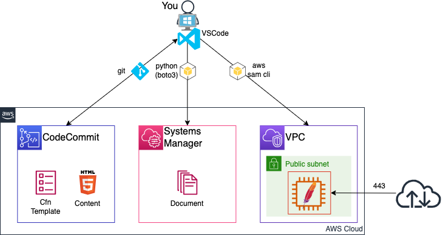

# IaC Self Learning<!-- omit in toc -->

つくりこわしができると幸せになれる.

## Contents<!-- omit in toc -->

- [1. はじめに](#1-はじめに)
  - [1.1. 目的](#11-目的)
  - [1.2. Iacメリット・デメリット](#12-iacメリットデメリット)
  - [1.3. IaCを学ぶモチベーション](#13-iacを学ぶモチベーション)
  - [1.4. 表記について](#14-表記について)
  - [1.5. 免責事項](#15-免責事項)
- [2. 開発環境構築](#2-開発環境構築)
  - [2.1. Require](#21-require)
  - [2.2. 設定](#22-設定)
    - [2.2.1. `pip`コマンドを実行して、`aws cli`をインストール](#221-pipコマンドを実行してaws-cliをインストール)
    - [2.2.2. IAMユーザのアクセスキー・シークレットアクセスキーを発行](#222-iamユーザのアクセスキーシークレットアクセスキーを発行)
    - [2.2.3. `aws configure`コマンドを実行して、`アクセスキー`,`シークレットアクセスキー`を設定](#223-aws-configureコマンドを実行してアクセスキーシークレットアクセスキーを設定)
    - [2.2.4. CodeCommit(コード管理)レポジトリ作成](#224-codecommitコード管理レポジトリ作成)
    - [2.2.5. CodeCommit認証設定](#225-codecommit認証設定)
    - [2.2.6. Git Clone(レポジトリのクローン)](#226-git-cloneレポジトリのクローン)
    - [2.2.7. Python仮想環境作成](#227-python仮想環境作成)
    - [2.2.8. VisualStudioCode(以下、VsCode)起動](#228-visualstudiocode以下vscode起動)
- [3. SAM使い方](#3-sam使い方)
  - [3.1. SAM用テンプレートファイル作成](#31-sam用テンプレートファイル作成)
  - [3.2. スタック作成](#32-スタック作成)
  - [3.3. スタック削除](#33-スタック削除)
- [4. Git使い方](#4-git使い方)
  - [4.1. Git Ignore](#41-git-ignore)
  - [4.2. Stage](#42-stage)
  - [4.3. Git Commit](#43-git-commit)
  - [4.4. Git Push](#44-git-push)
  - [4.5. Git Clone](#45-git-clone)
  - [4.6. その他](#46-その他)
- [5. CloudFormationテンプレート構造](#5-cloudformationテンプレート構造)
  - [5.1. クラウドフォーメーションとは](#51-クラウドフォーメーションとは)
  - [5.2. テンプレートファイル](#52-テンプレートファイル)
    - [5.2.1. フォーマット](#521-フォーマット)
    - [5.2.2. 構造](#522-構造)
    - [5.2.3. パラメータセクション](#523-パラメータセクション)
    - [5.2.4. リソースセクション](#524-リソースセクション)
  - [5.3. 疑似パラメータ](#53-疑似パラメータ)
  - [5.4. 組み込み関数](#54-組み込み関数)
- [6. IaCでEC2を立てる](#6-iacでec2を立てる)
  - [6.1. Templateファイル設計パターン](#61-templateファイル設計パターン)
  - [6.2. VPCテンプレート作成](#62-vpcテンプレート作成)
  - [6.3. EC2テンプレート作成](#63-ec2テンプレート作成)
- [7. IaCでApacheのセットアップ](#7-iacでapacheのセットアップ)
  - [7.1. Webサーバ構築(ShellScript編)](#71-webサーバ構築shellscript編)
    - [7.1.1. OS/Apacheセットアップ](#711-osapacheセットアップ)
    - [7.1.2. Webサイト稼働確認](#712-webサイト稼働確認)
  - [7.2. Webサーバ構築(Cfn編)](#72-webサーバ構築cfn編)
    - [7.2.1. Systems Manager Document](#721-systems-manager-document)
    - [7.2.2. Systems Manager Document の テスト](#722-systems-manager-document-の-テスト)
    - [7.2.3. SystemsManage StateManager](#723-systemsmanage-statemanager)
- [8. CodeCommit(Git)からコンテンツの展開](#8-codecommitgitからコンテンツの展開)
  - [8.1. コンテンツ作成と展開用コード修正](#81-コンテンツ作成と展開用コード修正)
  - [8.2. Git Push(作成したコンテンツをCodeCommitにPush)](#82-git-push作成したコンテンツをcodecommitにpush)
  - [8.3. 再構築](#83-再構築)

## 1. はじめに

### 1.1. 目的

- AWSサービスを使い、単純構成のWebサーバーを構築、デプロイを自動化し基本的なことを学び、IaCの開発・デバッグ・テストができるようになること目的としています.構成やセキュリティ,CD/CI等には触れません.

    

    |Item|役割|
    |---|---|
    |git|CodeCommitと開発したコードをやり取りするためのアプリ|
    |CodeCommit|コード管理.GithubやGitlabのAWS版|
    |CfnTemplate|Webサーバを構築するためのCloudFormationTemplateファイル|
    |Content|Web公開するコンテンツ(html)|
    |Python(boto3)|boto3: Pythonのモジュールでaws cliのPython版|
    |Document|EC2で動かすBATファイルのようなもの|
    |aws sam cli|PythonのモジュールでCloudFormationの拡張版.GUIより早くTry&Errorが可能|

### 1.2. Iacメリット・デメリット

- メリット
  - 手順書簡素化
  - 時間の有効活用(手順書見ながら作業不要なので、他のことに時間が使える)
  - 冪等性(誰がやっても同じ結果に) → 品質のむらがない
- デメリット
  - 学習コスト(時間がかかる)
  - 開発コスト(時間)が高い、覚えなければならないことが沢山
→ デメリットの方が大きいのでやる意味があるのが？正直、微妙.

### 1.3. IaCを学ぶモチベーション

- Docker(K8S) → ボタンぽちぽちじゃなく、CLIです.
- CD/CI       → ボタンぽちぽちじゃなく、CLIです.
- サーバーレス  → そもそもInfra不要!?.

とモダンな開発にコードを書くことは必須です.

- 環境定義署をおこして、
- 手順書見ながら、
- 作業証跡のスクショを切り貼り
- スクショと定義書を差異チェック

の手間を軽減できる筈.

### 1.4. 表記について

```text
ps> Powershellを示す
> Gitbashやbashを示す

プロンプトの文字はフォルダを示す.
> : work directory
cfn> : work directory/cfn
```

### 1.5. 免責事項

本文書の情報については充分な注意を払っておりますが、その内容の正確性等に対して一切保障するものではありません.本文章の利用で発生したいかなる結果について、一切責任を負わないものとします.また、本文書のご利用により、万一、ご利用者様に何かしらの不都合や損害が発生したとしても、責任を負うものではありません.

## 2. 開発環境構築

開発端末

- Windows10

### 2.1. Require

下記、3つのソフトをインストールしてください.

- [Python3.9](https://www.python.org/downloads/)
  - [パッケージのインストール必読](https://www.python.jp/install/windows/install.html)
- [git](https://git-scm.com/)
  - Git Credential Managerはインストールしないこと.
- [VisualStudioCode](https://code.visualstudio.com/download)

### 2.2. 設定

#### 2.2.1. `pip`コマンドを実行して、`aws cli`をインストール

Pythonのパッケージを管理するものが`pip`です.

`pip`でpipをUpgrade、awscli、pipenvをインストールします.

```bash
ps> python -m pip install pip --upgrade --user
ps> python -m pip install awscli --user
ps> python -m pip install pipenv --user
```

#### 2.2.2. IAMユーザのアクセスキー・シークレットアクセスキーを発行


#### 2.2.3. `aws configure`コマンドを実行して、`アクセスキー`,`シークレットアクセスキー`を設定

```bash
ps> aws configure
AWS Access Key ID : [アクセスキー]
AWS Secret Access Key : [シークレットキー]
Default region name : [リージョン]
Default output format : json
```

#### 2.2.4. CodeCommit(コード管理)レポジトリ作成

`aws codecommit`でレポジトリを作成します.

`レポジトリ`とはファイル(コード)や変更履歴を保存しておくための場所だと思ってください.

```bash
ps> aws codecommit create-repository --repository-name [レポジトリ名]
```

出力例

```bash
{
    "repositoryMetadata": {
        "accountId": "[アカウントID]",
        "repositoryName": "[レポジトリ名]",
        "cloneUrlHttp": "https://git-codecommit.[リージョン].amazonaws.com/v1/repos/[レポジトリ名]",
        "cloneUrlSsh": "ssh://git-codecommit.[リージョン].amazonaws.com/v1/repos[レポジトリ名]",
        "Arn": "arn:aws:codecommit:[リージョン]:[アカウントID]:[レポジトリ名]"
    }
}
```

レポジトリは、`aws configure`で設定したリージョンに作成されます.

#### 2.2.5. CodeCommit認証設定

```bash
ps> git config --global user.name [YOUR NAME]
ps> git config --global user.email [YOUR EMAIL ADDRESS]
ps> git config --global "credential.https://git-codecommit.*.amazonaws.com/v1/repos/[リポジトリ名].helper" '!aws codecommit credential-helper $@'
ps> git config --global "credential.https://git-codecommit.*.amazonaws.com/v1/repos/[リポジトリ名].UseHttpPath" true
```

```text
git commit(変更確定)するために必要な設定です.
git config --global user.name [YOUR NAME]
git config --global user.email [YOUR EMAIL ADDRESS]
ps> git config --global --edit # Configファイルを直接編集(viです.)

git config --global "credential・・・・"は、CodeCommitの認証にアクセスキー・シークレットキーを用いるために必要です.
Git Credential Manager を インストールしちゃうと、15分後ぐらいに認証が通らなくなります.
  コンパネ > 資格情報 > Windows資格情報 から、対象のCodeCommitを削除して一時認証情報を削除します.
```

#### 2.2.6. Git Clone(レポジトリのクローン)

適当な場所にフォルダを作成し、レポジトリのクローンをつくります.

```bash
ps> $wkdir = "$env:userprofile/Documents/[フォルダ名]" #[フォルダ名]は作成するフォルダの名前
ps> if (!(Test-Path $wkdir)) { New-Item -Path $wkdir -ItemType Directory | Out-Null } # フォルダがなければ、フォルダを作成
ps> Set-Location -Path $wkdir # フォルダに異動
ps> git clone https://git-codecommit.[リージョン].amazonaws.com/v1/repos/[レポジトリ名] # レポジトリのクローンをPCに作成
Cloning into [レポジトリ名]...
warning: You appear to have cloned an empty repository.
ps> Set-Location [レポジトリ名] # レポジトリ名のフォルダが作成される
ps> (Get-Location).Path # ← ここに表示されるPathが[ローカルレポジトリ]と言います
```

git clone の URLは、以下のいずれかの方法で確認できます.

- 手順2.2.4の`cloneUrlHttp`
- `aws codecommit get-repository --repository-name [レポジトリ名] --query repositoryMetadata.cloneUrlHttp --output text`
- ManagementConsole

#### 2.2.7. Python仮想環境作成

1台のパソコンでPython3.10, 3.8、きれいな環境(モジュールがない)から開発したくなります.

pipenvをつかい、フォルダ単位でPythonの仮想環境を作成します.

```bash
> cd [ローカルレポジトリ]
> python -m pipenv --python 3.9 # [ローカルレポジトリ]にPython3.9をインストール
Creating a virtualenv for this project...
Pipfile: C:\Users\xxxxxxxx\Documents\work\[レポジトリ名]\Pipfile
Using C:/Users/xxxxxxxx/AppData/Local/Programs/Python/Python39/python.exe (3.9.10) to create virtualenv...
[====] Creating virtual environment...created virtual environment CPython3.9.10.final.0-64 in 21306ms
  creator CPython3Windows(dest=C:\Users\xxxxxxxx\.virtualenvs\[レポジトリ名]-wTKRaSAf, clear=False, no_vcs_ignore=False, global=False)
  seeder FromAppData(download=False, pip=bundle, setuptools=bundle, wheel=bundle, via=copy, app_data_dir=C:\Users\xxxxxxxx\AppData\Local\pypa\virtualenv)
    added seed packages: pip==22.0.4, setuptools==62.1.0, wheel==0.37.1
  activators BashActivator,BatchActivator,FishActivator,NushellActivator,PowerShellActivator,PythonActivator

Successfully created virtual environment!
Virtualenv location: C:\Users\xxxxxxxx\.virtualenvs\[レポジトリ名]-*******
Creating a Pipfile for this project...
```

```bash
> cd [ローカルレポジトリ]
> python -m pipenv install aws-sam-cli  # [ローカルレポジトリ]に aws-sam-cli をインストール
Installing aws-sam-cli...
Adding aws-sam-cli to Pipfile's [packages]...
Installation Succeeded
Pipfile.lock not found, creating...
Locking [dev-packages] dependencies...
Locking [packages] dependencies...
          Building requirements...
Resolving dependencies...
Success!
Updated Pipfile.lock (dc4449)!
Installing dependencies from Pipfile.lock (dc4449)...
  ================================ 1/1 - 00:00:00
To activate this project's virtualenv, run pipenv shell.
Alternatively, run a command inside the virtualenv with pipenv run.
```

#### 2.2.8. VisualStudioCode(以下、VsCode)起動

CLIでCloudFormationTemplateを作成するのは無理なので、VsCodeを使います.

```bash
> cd [ローカルレポジトリ]
> code .
```

VsCodeを起動し、ファイル > フォルダを開く と同じです.

## 3. SAM使い方

簡単なテンプレートファイルを作成し、SAMでスタックの作成・削除を実施します.

### 3.1. SAM用テンプレートファイル作成

VsCode上で、`Ctrl + Shift + @`を押すと、ターミナルが起動します.

```bash
> python -m pipenv shell # Python仮想環境のShellに入る
Launching subshell in virtual environment...

> mkdir cfn
> cd cfn
cfn> touch template.yml
```

- cfn/template.yml に コピーします.

    ```yaml
    AWSTemplateFormatVersion: '2010-09-09'  # 宣言文のようなもの
    Transform: AWS::Serverless-2016-10-31   # aws sam cliを利用するために必要
    Description: >                          # 説明文
        First Cloud Formation
    Parameters:                             # スタック作成時の入力パラメータ
      VpcCidr:                              # パラメータ名
        Description: Cidr block for vpc.    # パラメータ説明文
        Type: String                        # パラメータ型
        Default: 10.0.0.0/22                # 初期値
    Resources:                              # AWSリソースブロック
      Vpc:                                  # リソース論理名
        Type: AWS::EC2::VPC                 # リソースの識別
        Properties:                         # リソースプロパティブロック
          CidrBlock: !Ref VpcCidr           # 変数 VpcCidrで指定された値
          Tags:
          - Key: Name
            Value: !Ref AWS::StackName      # 擬似パラメータ: スタック名
    ```

    3行目までは、このような書き方が必要なんだと覚えてください。

  - Parameter: Googleで[cfn パラメータ]でリファレンスを検索してください.リスト選択など、入力値のValidation方法などを調べます.

  - Resource: Googleで[cfn サービス名(やAWS::EC2::VPC)]でリファレンスを検索してください.プロパティの書き方,必須入力値や戻り値などを調べます.

  - 擬似パラメータ: Googleで[cfn 擬似パラメータ]でリファレンスを検索してください.AWSアカウントやリージョンにしばられないテンプレートファイル作りなどで使います.

### 3.2. スタック作成

`sam build`でtemplate.ymlをCloudFormationにUploadされるファイルが.aws-samに作成されます.

```bash
cfn> sam build       # cfnフォルダにtemplate.ymlファイルがあれば、Buildしてくれる
Build Succeeded
Built Artifacts  : .aws-sam\build
Built Template   : .aws-sam\build\template.yaml
Commands you can use next
=========================
[*] Validate SAM template: sam validate
[*] Invoke Function: sam local invoke
[*] Test Function in the Cloud: sam sync --stack-name {stack-name} --watch
[*] Deploy: sam deploy --guided
```

`sam deploy -g`でスタックを作成(AWSリソース作成)します.`samconfig.toml`に設定情報が書き込まれます.

```bash
cfn> sam deploy -g   # Buildしたテンプレファイルを展開してくれる(初回は、「-g」パラメータ入力が必須)
Configuring SAM deploy
======================
        Looking for config file [samconfig.toml] :  Not found
        Setting default arguments for 'sam deploy'
        =========================================
        Stack Name [sam-app]: [スタック名]              # CloudFormation スタック名を入力
        AWS Region [ap-northeast-1]:                    # スタックを作成するリージョン
        Parameter VpcCidr [10.0.0.0/22]:                # テンプレートに作成したパラメータ
        Confirm changes before deploy [y/N]:            # デプロイ前に変更点の確認するか
        Allow SAM CLI IAM role creation [Y/n]:          # SAM CLI から IAMロールを作成することを許可するか
        Disable rollback [y/N]:                         # スタック作成に失敗した場合、Rollbackの有効・無効の選択
        Save arguments to configuration file [Y/n]:     # 入力した値をConfigファイルに保存するか
        SAM configuration file [samconfig.toml]:        # Configファイル名指定
        SAM configuration environment [default]:        # Configu環境名指定

CloudFormation stack changeset                          # ChangesetでVPCが追加させることがわかる
---------------------------------------------------------------------------------------------------------
Operation                  LogicalResourceId          ResourceType               Replacement
---------------------------------------------------------------------------------------------------------   
+ Add                      Vpc                        AWS::EC2::VPC              N/A
---------------------------------------------------------------------------------------------------------

CloudFormation events from stack operations             # スタック作成のログ
---------------------------------------------------------------------------------------------------------
ResourceStatus             ResourceType               LogicalResourceId          ResourceStatusReason       
---------------------------------------------------------------------------------------------------------   
CREATE_IN_PROGRESS         AWS::EC2::VPC              Vpc                        -
CREATE_IN_PROGRESS         AWS::EC2::VPC              Vpc                        Resource creation        
                                                                                 Initiated
CREATE_COMPLETE            AWS::EC2::VPC              Vpc                        -
CREATE_COMPLETE            AWS::CloudFormation::Sta   miya-stack                 -
                           ck
---------------------------------------------------------------------------------------------------------   

Successfully created/updated stack - miya-stack in ap-northeast-3
```

マネージメントコンソールからスタックが作成されていることを確認してみましょう.

### 3.3. スタック削除

`sam delete`で`samconfig.toml`に記述されているスタックを削除します.s

```bash
cfn> sam delete
Are you sure you want to delete the stack my-stack in the region ap-northeast-1 ? [y/N]: y
Are you sure you want to delete the folder my-stack in S3 which contains the artifacts? [y/N]: y
- Deleting S3 object with key my-stack/aec7e9cf2ac98b0463f03cbc8b8c8713.template
- Deleting Cloudformation stack my-stack

Deleted successfully
```

マネージメントコンソールからスタックが削除されていることを確認してみましょう.

## 4. Git使い方

テンプレートファイルをCodeCommitを利用して管理します.

### 4.1. Git Ignore

`.gitignore`ファイルに管理したくないパスを記載して、レポジトリから除外します.

今回、除外したいもの

- `sam build`で毎度生成されるので`.aws-sam/`フォルダは、管理対象外とします.

```bash
> touch .gitignore
> echo "*/.aws-sam/" >> .gitignore
```

`.gitignore`ファイルの中身

```text
*/.aws-sam/
```

VsCodeでは、除外ファイル・フォルダはグレー表示されます.

### 4.2. Stage

変更をCommitするファイルをステージングエリアに追加します.

 ```bash
 > git add . # 「.」はすべてのファイルを意味します.
 warning: LF will be replaced by CRLF in .gitignore. # 改行コードを置換したメッセージなので無視できます.
 ```

 ```bash
> git status
Changes to be committed:
  (use "git rm --cached <file>..." to unstage)
        new file:   .gitignore
        new file:   Pipfile
        new file:   Pipfile.lock
        new file:   cfn/samconfig.toml
        new file:   cfn/template.yml
 ```

VsCodeの場合、ソース管理`Ctrl + Shift + G`でステージングエリアにあるファイルを確認できます.ステージングエリアにあるファイルを右クリックし、「変更のステージング解除」でもとに戻すことができます.

(`Ctrl + Shift + E`でエクスプローラが表示されます.)

### 4.3. Git Commit

変更・追加したファイルをCommitします.

```bash
> git commit -m 'init commit'
 5 files changed, 611 insertions(+)
 create mode 100644 .gitignore
 create mode 100644 Pipfile
 create mode 100644 Pipfile.lock
 create mode 100644 cfn/samconfig.toml
 create mode 100644 cfn/template.yml
```

### 4.4. Git Push

Commitした内容をCodeCommitにPushします.

`git branch`でブランチ名を確認します.

`git push`でリモートレポジトリにPushします.

```bash
> git branch
* main       # <- 今いるブランチ名

> git push -u origin [ブランチ名]
Total 4 (delta 0), reused 0 (delta 0), pack-reused 0
To https://git-codecommit.[リージョン].amazonaws.com/v1/repos/[レポジトリ]
 * [new branch]      main -> main
Branch 'main' set up to track remote branch 'main' from 'origin'.
```

マネジメントコンソールから、レポジトリにファイルがアップされているか確認してください.

### 4.5. Git Clone

CodeCommitのリモートレポジトリをPCのローカルレポジトリにクローンします.

1. ローカルレポジトリを削除します.(VsCodeでレポジトリを開いている場合は、VsCodeを閉じてください.)

```bash
> cd [ローカルレポジトリ]
> python -m pipenv --rm # Python仮想環境削除
Removing virtualenv...
> cd ..
> rm -rf [レポジトリ名]
```

クローンするレポジトリのURLを取得します.

- CLI

  ```bash
  > aws codecommit get-repository --repository-name [レポジトリ名]
  {
    "repositoryMetadata": {
      "accountId": "123456789012",
      "cloneUrlHttp": "https://git-codecommit.[リージョン].amazonaws.com/v1/repos/[レポジトリ]", # クローンURL
    }
  }
  # 1部だけ表示
  ```

- GUI

  CodeCommit > レポジトリ > [レポジトリ名]

  

  でUrlがコピーされます.

Git Clone します.

```bash
> cd [ワークディレクトリ]
> git clone [クローンURL]
remote: Counting objects: 5, done.
Unpacking objects: 100% (5/5), 822 bytes | 137.00 KiB/s, done.
> cd [レポジトリ名] # <- 慣れないと忘れがちです
```

Python 仮想環境削除したので再構築します.

```bash
> python -m pipenv sync
Creating a virtualenv for this project...
All dependencies are now up-to-date!
```

### 4.6. その他

branch, pull requestは、後ほど.

## 5. CloudFormationテンプレート構造

### 5.1. クラウドフォーメーションとは

Templateファイル(抽象的)からスタック(実体・リソース)を作成します.

同じテンプレートファイルで異なる名前のスタックを作成すると、柴田大知・未崎のような双子関係になります.なので、本番・ステージング環境の構築やBlue＆GreenDeployに活用できます.

### 5.2. テンプレートファイル

#### 5.2.1. フォーマット

Templateファイルは、JSON・YAML形式をサポートしていますが、可読性が良いYAMLを使用します.

Cfnは、[YAML](https://yaml.org/)バージョン1.1の仕様をサポートしていますが、以下の機能は非サポートです.

- binary, omap, pairs, set, timestamp
- Aliases
- Hash merges
  
#### 5.2.2. 構造

テンプレートのセクション

```yaml
AWSTemplateFormatVersion: "version date"
Description:
  String
Metadata:
  template metadata
Parameters:
  set of parameters
Rules:
  set of rules
Mappings:
  set of mappings
Conditions:
  set of conditions
Transform:
  set of transforms
Resources:
  set of resources
Outputs:
  set of outputs
```

- AWSTemplateFormatVersion
  - テンプレートが準拠している AWS CloudFormation テンプレートバージョン.
- Description(オプション)
  - テンプレートの説明文.AWSTemplateFormatVersionセクションの後に記述すること.
- Metadata(オプション)
  - テンプレートに関する追加情報を提供するオブジェクト.
- Parameters(オプション)
  - スタックを作成または更新する際、テンプレートに渡すことができる値.
- Rules(オプション)
  - スタックの作成またはスタックの更新時に、テンプレートに渡されたパラメータまたはパラメータの組み合わせを検証.
- Mappings(オプション)
  - キーと関連する値のマッピング.Resources セクションと Outputs セクションで Fn::FindInMap 組み込み関数を使用することで、キーと対応する値を一致させることが可能.
- Conditions(オプション)
  - 特定のリソースを作成するか、リソースのプロパティ値の制御など、判断条件を定義.
- Transform(オプション)
  - SAMの場合、Transform: AWS::Serverless-2016-10-31.
- Resources(必須)
  - スタックリソースとそのプロパティを指定.
- Outputs(オプション)
  - スタックの戻り値やパラメータ値を出力.

#### 5.2.3. パラメータセクション

Parametersセクションの書き方

```yaml
Parameters:
  LogicalID:
    Type: DataType
    Property: Value
```

- LogicalID:
  - テンプレート内で一意なID

- Type:
  - String: 文字列
  - Number: 整数または浮動小数点
  - [その他](https://docs.aws.amazon.com/ja_jp/AWSCloudFormation/latest/UserGuide/parameters-section-structure.html#parameters-section-structure-properties-type)

- Property:
  - AllowedPattern: String 型に使用できるパターンを表す正規表現
  - AllowedValues: ラメーターに許容される一連の値を含む配列
  - ConstraintDescription: 制約が違反された場合に、制約について説明する文字列
  - Default: スタックの作成時に値を指定しなかった場合に、テンプレートで使用される値
  - Description: パラメーターについて説明
  - MaxLength: String 型に使用できる最大文字数
  - MinLength: String 型に使用できる最小文字数
  - MaxValue: Number 型に使用できる数値の最大値
  - MinValue: Number 型に使用できる数値の最小値
  - NoEcho: NoEcho 属性を true に設定するとアスタリスク (*****) としてマスクされたパラメータ値を返します

#### 5.2.4. リソースセクション

Resourcesセクションの書き方

```yaml
Resources:
  LogicalID:
    Type: ResourceType
    Properties:
      Key: Value
```

- LogicalID:
  - テンプレート内で一意なID

- Type:
  - [ここから探す](https://docs.aws.amazon.com/ja_jp/AWSCloudFormation/latest/UserGuide/aws-template-resource-type-ref.html)

- Properties:
  - Typeで指定したResourceTypeに従って記述します.

### 5.3. 疑似パラメータ

疑似パラメータとは、事前定義されたパラメータ.

例

```yaml
Resources:
  Vpc:
    Type: AWS::EC2::VPC
    Properties:
      CidrBlock: 10.0.0.0/22
      Tags:
      - Key: Name
        Value: !Ref AWS::Region # ← スタックを作成したリージョン名が入る
```

疑似パラメータ

- AWS::AccountId
  - スタックが作成されているアカウントの AWS アカウント ID
- AWS::NotificationARNs
  - スタックの通知 Amazon リソースネーム (ARN) のリスト.リストから 1 つの ARN を取得するには、Fn::Select を使用
- AWS::NoValue
  - Fn::If 組み込み関数の戻り値として指定すると、対応するリソースプロパティを削除
- AWS::Partition
  - 標準の AWS リージョンの場合、パーティションは aws
  - 中国 (北京および寧夏) リージョンのパーティションは aws-cn
  - AWS GovCloud (US-West) リージョンにあるリソースのパーティションは aws-us-gov
- AWS::Region
  - リソースが作成されているリージョンを表す文字列
- AWS::StackId
  - スタックの ID
- AWS::StackName
  - スタックの名前
- AWS::URLSuffix
  - 通常 `amazonaws.com`
  - 中国 (北京) リージョンのサフィックスは `amazonaws.com.cn`

### 5.4. 組み込み関数

スタックの管理に役立ついくつかの組み込み関数

例

```yaml
Resources:
  Vpc:
    Type: AWS::EC2::VPC
    Properties:
      CidrBlock: 10.0.0.0/22
      Tags:
      - Key: Name
        Value: !Ref AWS::Region # パラメータを参照する関数
      - Key: Name1
        Value: !Sub ${AWS::AccounId}-vpc # 変数と文字結合
```

[関数たち](https://docs.aws.amazon.com/ja_jp/AWSCloudFormation/latest/UserGuide/intrinsic-function-reference.html)

## 6. IaCでEC2を立てる

不要なリソースもなにかの参考になればという考えでTemplateファイルに記述しています.

```bash
VSCode起動
> cd [ローカルレポジトリ]
> code .
```

### 6.1. Templateファイル設計パターン

1. 単一のファイル
2. NestStack
3. CrossReference
4. ParameterStore

NestStackでテンプレートを作成します.(AWSリソースがReplaceされるか？されないか？わからないので検証以外はお勧めしません.)

### 6.2. VPCテンプレート作成

1. Build範囲

    

1. ルートテンプレート作成

    親テンプレート.

    template.ymlファイルを書き換えます.

    [cfn/template.yml](./6.template/1/template.yml)

    ```yml
    Parameters:                               # Parameterセクション
      Env:
        Type: String
        Default: stg
        AllowedValues: [ prd, stg ]           # 環境を指定(prd, stg以外入力不可)
      VpcCidr:
        Type: String
        Default: 10.0.0.0/22                  # VpcCidrのデフォルトの値
      Resources:
        Vpc:
          Type: AWS::CloudFormation::Stack    # ネストスタック
          Properties:
            TemplateURL: vpc/vpc.yml          # 子スタックのテンプレートファイルパス
            Parameters:                       # vpc.yml スタックへ渡すパラメータ
              StackName: !Ref AWS::StackName
              Env: !Ref Env
              VpcCidr: !Ref VpcCidr
    ```

1. VPCテンプレートファイル作成

    VPC用テンプレートファイルを作成します.

    ```bash
    cfn> mkdir vpc
    cfn> touch vpc/vpc.yml
    ```

    [cfn/vpc/vpc.yml](./6.template/1/vpc.yml)

1. Deploy

    `sam build && sam deploy -g`でVPCを作成します.

    CAPABILITY_AUTO_EXPAND: NestStackに必要な値です.

    ```bash
    cfn> sam build && sam deploy -g --capabilities CAPABILITY_IAM CAPABILITY_AUTO_EXPAND
    Setting default arguments for 'sam deploy'
    =========================================
    Stack Name [sam-app]: スタック名
    AWS Region [ap-northeast-1]: リージョン
    Parameter Env [stg]: stg
    Parameter VpcCidr [10.0.0.0/22]:
    Confirm changes before deploy [y/N]:
    Allow SAM CLI IAM role creation [Y/n]:
    Disable rollback [y/N]:
    Save arguments to configuration file [Y/n]:
    SAM configuration file [samconfig.toml]:
    SAM configuration environment [default]:

    Successfully created/updated stack -  スタック名 in リージョン名
    ```

### 6.3. EC2テンプレート作成

1. Build範囲

    

2. ルートテンプレート作成

    親テンプレート.

    IAM、EC2のテンプレートファイルをコールするため、template.ymlファイルを書き換えます.

    [cfn/template.yml](./6.template/2/template.yml)

3. Iamテンプレートファイル作成

    IAM用テンプレートファイルを作成します.

    ```bash
    cfn> mkdir iam
    cfn> touch iam/iam.yml
    ```

    [cfn/iam/iam.yml](6.template/2/iam.yml)

4. EC2テンプレートファイル作成

    EC2用テンプレートファイルを作成します.

    ```bash
    cfn> mkdir instance
    cfn> touch instance/web.yml
    ```

    [cfn/instance/web.yml](6.template/2/web.yml)

5. Deploy

    `sam build && sam deploy -g`でIAMとEC2を作成します.

    `--capabilities`は、`samconfig.toml`に保存されている筈なので不要です.

    ```bash
    cfn> sam build && sam deploy
    Setting default arguments for 'sam deploy'
    =========================================
    Stack Name [sam-app]:
    AWS Region [ap-northeast-1]:
    Parameter Env [stg]:
    Parameter VpcCidr [10.0.0.0/22]:
    Parameter BuildWeb [yes]: yes       # ← ここの値を変えることでEC2のBuild・Terminateをコントロールします.
    Confirm changes before deploy [y/N]:
    Allow SAM CLI IAM role creation [Y/n]:
    Disable rollback [y/N]:
    Save arguments to configuration file [Y/n]:
    SAM configuration file [samconfig.toml]:
    SAM configuration environment [default]:

    Successfully created/updated stack -  スタック名 in リージョン名
    ```

6. Session Manager 接続

    Session Manager から OS にログインできることを確認してください.

   - Session Manager
  
        Managed Console > EC2 > インスタンス > 接続 > Session Manager > 接続

    Session Managerのデフォルトは、`sh`です.`# bash`で使い慣れたTerminalに切り替えができます.

## 7. IaCでApacheのセットアップ

CloudFormationで作成できるのは、OSまでです.OSレイア以上のセットアップはShellScriptで行います.

一般的に、Ansibleなどのツールで行うのが一般的ですが、Ansible知らないので力技でセットアップします.

ポイント

- Shellが何回実行されても同じ結果になるようにすること(冪等性).

### 7.1. Webサーバ構築(ShellScript編)

手動でやっていることを、ShellScript化してWebサーバをセットアップします.

#### 7.1.1. OS/Apacheセットアップ

[ShellScript](./7.web/1/setup.sh)の実行.

SessionManagerからWebサーバにログイン、`sudo su -`に切り替えて実行します.

Tag名(11行目)の値は、環境に合わせて変更してください.

[ShellScript](./7.web/1/setup.sh)をコピーし、ターミナルに貼り付けます.

#### 7.1.2. Webサイト稼働確認

1. WebサーバのGlobalIPを確認.(Cfn > スタック > ルートスタック名 > 出力 もしくは、 EC2 インスタンスより)
2. GoogleChromeにGlobalIPアドレスを入力し、"Test Page"が表示されることを確認してください.
3. IaCなので、

    ```bash
    > curl -v http://xxx.xxx.xxx.xxx
    ```

    ```powershell
    ps> Invoke-WebRequest http://xxx.xxx.xxx.xxx
    ```

### 7.2. Webサーバ構築(Cfn編)

ShellScript化できたのでWebサーバをCfnでセットアップします.

#### 7.2.1. Systems Manager Document

Systems Manager Document に作成したShellScriptをUploadします.

RunCommand や StateManager で OSにログインすることなくWebのセットアップを実現できます.


CloudFormationではなく、Python(boto3)を使いShellScriptをUploadします.

1. SSM DocumentのWorkディレクトリを作成します.

    ```bash
    > mkdir -p ssm/documents
    > cd ssm
    ssm> touch documents/ssm-apache.yml # ssm-apache: SSM Docuementの名前になりますので重複しない名前に変更してください.
    ssm> touch upload.py
    ```

    それぞれのファイルにコピーしてください.

    [ssm/documents/ssm-apache.yml](7.web/2/ssm-apache.yml)

    ```yml
    parameters:       # パラメータセクション
      yumupdate:      # yum update する/しない フラグ
        type: String
        default: 'false'
        description: "(Option) yum update flag"
        allowedValues: [ 'true', 'false' ]
      tagname:        # Tagを利用した識別子
        type: String
        default: ''
        description: "(Required) ec2 tag name"
    mainSteps:                      # 処理
      - action: aws:runShellScript  # aws提供のrunShellScriptを利用
        name: IsAmzLinux2           # ステップ名
        precondition:               # Windowsだと動かないように制御
          StringEquals:
          - platformType
          - Linux
        inputs:
          onFailure: exit           # exit 0 以外は、処理中断
          runCommand:               # コマンド
          - |
            #!/bin/bash
    ```

    [ssm/upload.py](7.web/2/upload.py)

    ```python
    ''' 利用する外部モジュール '''
    import boto3 # AWS CLIのようなもの
    import os                 # ファイル操作
    from pathlib import Path  # ファイル操作など
    import hashlib  # Ssm Documentの記述内容を比較するのに利用
    from botocore.exceptions import ClientError # Boto3のエラーハンドリング

    ssm = boto3.client('ssm') # ssmクラス https://boto3.amazonaws.com/v1/documentation/api/latest/reference/services/ssm.html

    current_dir       = Path(__file__).parent             # 本ファイルのディレクトリパス
    ssm_document_dir  = current_dir.joinpath('documents') # current_dir / documents のこと
    document_files    = os.listdir(ssm_document_dir)      # current_dir / documents のファイルリスト(documentsにフォルダつくらないで.)

    for d in document_files:                  # ファイルの数分Loop
      document_name = os.path.splitext(d)[0]  # Ssm Documentの名前を、ファイル名(拡張子なし)と定義
      try:
        with open(ssm_document_dir.joinpath(d), encoding='utf-8') as f: # ファイルをUTF8で開く
          # DocumentにUpload
          content       = f.read() # ファイルを読取り
          content_hash  = hashlib.sha256(content.encode()).hexdigest()  # ファイルのHash値
          ssm.create_document(Name=document_name, DocumentType='Command', DocumentFormat='YAML', Content=content) # SsmDocumentsにScriptをアップ
      except ClientError as e:
        if e.response['Error']['Code'] == 'DocumentAlreadyExists':
          # 同名Documentが存在ずる場合、コンテンツ内容を比較. 差分あり:更新、差分なし:スキップ.
          document = ssm.describe_document(Name=document_name)['Document']  # 既存SsmDocumentの情報収集
          document_version = document['DocumentVersion']                    # 既存SsmDocumentのバージョン
          document_hash = document['Hash']                                  # 既存SsmDocumentのHash
          if (content_hash != document_hash): # 現新のHash値が異なる場合
            try:
              response = ssm.update_document(Name=document_name, Content=content, DocumentVersion='$LATEST')['DocumentDescription']['DocumentVersion'] # SsmDocumentを更新
              ssm.update_document_default_version(Name=document_name, DocumentVersion=response) # Defaultバージョンを最新版に更新
            except ClientError as e:
              print(f'Err: {d} {e}')
            else:
              print(f'Inf: {d} updated.')
          else:
            print(f'Inf: {d} No Action.')
      else:
        print(f'Inf: {d} installed.')
    ```

2. ssm/documents/ssm-apache.yml を SSM Documentにアップロードします.

    ```bash
    ssm> python upload.py
    Inf: ssm-apache.yml installed.
    ```

#### 7.2.2. Systems Manager Document の テスト

1. UbuntuでDocumentを実行した場合のテスト

    CfnでUbuntuの起動ができるようにテンプレートを書き換えます.

    変更箇所は、Diffなどをつかい比較してください.

    [cfn/template.yml](7.web/3/template.yml)

    [cfn/instance/web.yml](7.web/3/web.yml)

    ```yml
    Ubuntu:   # Region別 AMIId: https://cloud-images.ubuntu.com/locator/ec2/
      ap-northeast-1:
        AmiId: ami-02a829837a849f2ab　
      us-east-1:
        AmiId: ami-0c76ec1c339c9f28f

    LT:
      Type: AWS::EC2::LaunchTemplate
      Properties:
        LaunchTemplateData:
          ImageId:  !FindInMap [ !Ref Distribution, !Ref AWS::Region, AmiId ] # Distrobution と Stackを作成するリージョン に合わせてAMIIDを指定します.
    ```

2. Ubuntuを起動

    ```bash
    cfn> sam build && sam deploy -g
    Setting default arguments for 'sam deploy'
    =========================================
    Stack Name [sam-app]:
    AWS Region [ap-northeast-1]:
    Parameter Env [stg]:
    Parameter VpcCidr [10.0.0.0/22]:
    Parameter BuildWeb [yes]:
    Parameter Distribution [Amazon]: Ubuntu
    Confirm changes before deploy [y/N]:
    Allow SAM CLI IAM role creation [Y/n]:
    Disable rollback [y/N]:
    Save arguments to configuration file [Y/n]:
    SAM configuration file [samconfig.toml]:
    SAM configuration environment [default]:

    -----------------------------------------------------------
    Outputs
    -----------------------------------------------------------
    Key                 SsmRunCommand
     :
     :
    Key                 SsmCommandResult
     :
     :

    Successfully created/updated stack -  スタック名 in リージョン名
    ```

    SessionManagerにて

    ```bash
    > cat /etc/issue
    Ubuntu xx.xx
    ```

3. RunCommand実行

    SSM Document名を指定し、`aws ssm send-command`でRunCommandを実行、`aws ssm list-command-invocations`で実行結果を確認します.([DOCUMENT_NAME]に作成したDocument名と読み替えてください)

     `sam deploy`出力(Outputs)の SsmRunCommand, SsmCommandResult にコマンド記述してあるので、コピペして使ってください.

    ```bash
    > COMMANDID=$(aws ssm send-command --instance-ids [WEB_INSTANCEID] --parameters yumupdate=false,tagname=**** --query "Command.CommandId" --output text --document-name [DOCUMENT_NAME])
    > aws ssm list-command-invocations --command-id ${COMMANDID} --details
    {
        "CommandInvocations": [
            {
                "DocumentVersion": "$DEFAULT",
                "Status": "Failed",
                "StatusDetails": "Failed", 
            }
        ]
    }
    一部のみ表示
    ```

    Systems Manager > Run Command > コマンド履歴 からでもログが確認できます.

4. AmazonLinux2を起動

    ```bash
    cfn> sam build && sam deploy -g
    Setting default arguments for 'sam deploy'
    =========================================
    Stack Name [sam-app]:
    AWS Region [ap-northeast-1]:
    Parameter Env [stg]:
    Parameter VpcCidr [10.0.0.0/22]:
    Parameter BuildWeb [yes]:
    Parameter Distribution [Ubuntu]: Amazon
    Confirm changes before deploy [y/N]:
    Allow SAM CLI IAM role creation [Y/n]:
    Disable rollback [y/N]:
    Save arguments to configuration file [Y/n]:
    SAM configuration file [samconfig.toml]:
    SAM configuration environment [default]:

    Successfully created/updated stack -  スタック名 in リージョン名
    ```

5. RunCommand実行

    SSM Document名を指定し、`aws ssm send-command`でRunCommandを実行、`aws ssm list-command-invocations`で実行結果を確認します.([DOCUMENT_NAME]に作成したDocument名と読み替えてください)

     `sam deploy`出力(Outputs)の SsmRunCommand, SsmCommandResult にコマンド記述してあるので、コピペして使ってください.

    ```bash
    > COMMANDID=$(aws ssm send-command --instance-ids [WEB_INSTANCEID] --parameters yumupdate=false,tagname=******** --query "Command.CommandId" --output text --document-name [DOCUMENT_NAME])
    > aws ssm list-command-invocations --command-id ${COMMANDID} --details
    {
        "CommandInvocations": [
            {
                "DocumentVersion": "$DEFAULT",
                "Status": "Success",
                "StatusDetails": "Success",
            }
        ]
    }
    一部のみ表示
    ```

    Systems Manager > Run Command > コマンド履歴 からでも ログが確認できます.

#### 7.2.3. SystemsManage StateManager

StateManagerを利用してWebサイトをあるべき状態になるよう、テンプレートを書き換えます.

変更箇所は、Diffなどをつかい比較してください.

[cfn/template.yml](7.web/4/template.yml)
[cfn/instance/web.yml](7.web/4/web.yml)

1. EC2をTerminate.

    ```bash
    cfn> sam build && sam deploy -g
    Setting default arguments for 'sam deploy'
    =========================================
    Stack Name [sam-app]:
    AWS Region [ap-northeast-1]: 
    Parameter Env [stg]: 
    Parameter VpcCidr [10.0.0.0/22]: 
    Parameter BuildWeb [yes]: no
    Parameter Distribution [Amazon]: 
    Parameter AssociationName []: [SSM DOCUMENT NAME]
    Parameter YumUpdate [false]: false
    Confirm changes before deploy [y/N]: 
    Allow SAM CLI IAM role creation [Y/n]:
    Disable rollback [y/N]:
    Save arguments to configuration file [Y/n]: 
    SAM configuration file [samconfig.toml]: 
    SAM configuration environment [default]:

    Successfully created/updated stack - スタック名 in リージョン名
    ```

2. EC2をBuild.

    ```bash
    cfn> sam build && sam deploy -g
    Setting default arguments for 'sam deploy'
    =========================================
    Stack Name [sam-app]:
    AWS Region [ap-northeast-1]: 
    Parameter Env [stg]: 
    Parameter VpcCidr [10.0.0.0/22]: 
    Parameter BuildWeb [yes]: yes
    Parameter Distribution [Amazon]: 
    Parameter AssociationName []:
    Parameter YumUpdate [false]: false
    Confirm changes before deploy [y/N]: 
    Allow SAM CLI IAM role creation [Y/n]:
    Disable rollback [y/N]:
    Save arguments to configuration file [Y/n]: 
    SAM configuration file [samconfig.toml]: 
    SAM configuration environment [default]:

    Successfully created/updated stack -  スタック名 in リージョン名
    ```

Systems Manager > ステートマネージャ > アソシエーションID > 実行履歴 > 実行ID > 出力 から ログの確認ができます.

## 8. CodeCommit(Git)からコンテンツの展開

WebサーバにGitをインストール、レポジトリからコンテンツを展開します.


### 8.1. コンテンツ作成と展開用コード修正

1. コンテンツフォルダを作成し、コンテンツを配置します.

    ```bash
    > mkdir content
    > cd content
    content> mkdir style
    content> touch index.html
    content> touch style/style.css
    ```

    [content/index.html](8.content/1/index.html)

    [content/style/style.css](8.content/1/style/style.css)

1. TemplateにレポジトリParameterを追加します.

    [cfn/template.yml]

1. CodeCommitレポジトリからGit Clone可能になるよう、Policyを追加します.

    [cfn/iam/iam.yml](8.content/1/iam.yml)

1. StateManegerのパラメータを追加します.

    [cfn/instance/web.yml](8.content/1/web.yml)

1. Gitのインストール、コンテンツの展開ができるよう、Documentを修正します.

    [ssm/documents/ssm-apache.yml](8.content/1/ssm-apache.yml)

    ```bash
    ssm> python upload.py
    Inf: ssm-apache.yml updated.
    ```

### 8.2. Git Push(作成したコンテンツをCodeCommitにPush)

CodeCommitにPushします.

```bash
> git add .
> git commit -m 'first commit'
> git push -u origin [ブランチ名]
# > git status
# On branch [ブランチ名]
```

### 8.3. 再構築

作り直しします.

```bash
cfn> sam delete --no-prompts
Deleted successfully

cfn> sam build && sam deploy -g --capabilities CAPABILITY_IAM CAPABILITY_AUTO_EXPAND
    Setting default arguments for 'sam deploy'
    =========================================
    Stack Name [sam-app]: スタック名
    AWS Region [ap-northeast-1]: リージョン
    Parameter Env [stg]:
    Parameter VpcCidr [10.0.0.0/22]:
    Parameter BuildWeb [yes]:
    Parameter Distribution [Amazon]: 
    Parameter AssociationName []: SSM Document名
    Parameter YumUpdate [false]: true
    Parameter CloneUrl []: CodeCommit HTTPSクローン URL
    Parameter Branch []: 利用するブランチ名
    Parameter ContentFolder [content]: htmlファイルがあるフォルダ名
    Confirm changes before deploy [y/N]:
    Allow SAM CLI IAM role creation [Y/n]:
    Disable rollback [y/N]:
    Save arguments to configuration file [Y/n]:
    SAM configuration file [samconfig.toml]:
    SAM configuration environment [default]:

    Successfully created/updated stack -  スタック名 in リージョン名
```
